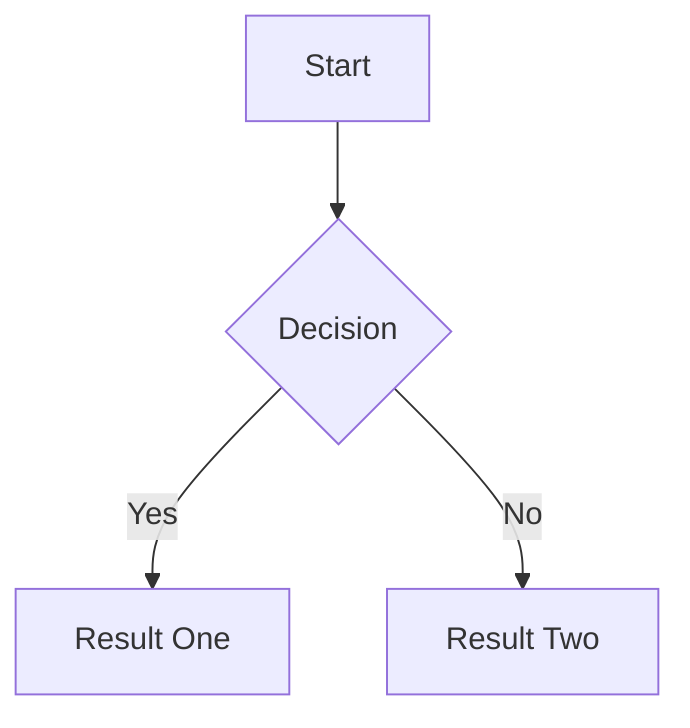

# FAQ

## Contents

- [How do I enable Markdown in my notes?](#how-do-i-enable-markdown-in-my-notes)
- [How do I enable Mermaid diagrams in my notes?](#how-do-i-enable-mermaid-diagrams-in-my-notes)
- [How do I edit several todos at once?](#how-do-i-edit-several-todos-at-once)
- [What does the done lane mean for dashboard stats?](#what-does-the-done-lane-mean-for-dashboard-stats)
- [Are tag colors personal, or shared with the team?](#are-tag-colors-personal-or-shared-with-the-team)
- [How do I use Scrumboy with Claude or other MCP clients?](#how-do-i-use-scrumboy-with-claude-or-other-mcp-clients)
- [What are VAPID keys, and do I need them?](#what-are-vapid-keys-and-do-i-need-them)
- [How does auditing work, and where can I see it?](#how-does-auditing-work-and-where-can-i-see-it)
- [Does Scrumboy use telemetry, tracking, or “phone home”?](#does-scrumboy-use-telemetry-tracking-or-phone-home)
- [What do I need to do to contribute?](#what-do-i-need-to-do-to-contribute)

# Notes
## How do I enable Markdown in my notes?

Set `SCRUMBOY_MARKDOWN_NOTES_ENABLED=1` on the server (also accepts `true`, `on`, or `yes`; case-insensitive). The feature defaults to off.

After a restart, the todo dialog **Notes** field shows **markdown** and **preview** tabs. **markdown** is the source editor; **preview** is a sanitized rendered view. Supported syntax includes headings, emphasis, lists, blockquotes, inline and fenced code, horizontal rules (`---` on its own line with blank lines around it), and safe `http`/`https` links.

Notes are still stored as raw markdown in `todos.body`. Todo titles and board card titles stay plain text. The server exposes `markdownNotesEnabled` on `/api/auth/status` so the UI only enables preview when the server has opted in.

Preview hardening: HTML in notes is not rendered; images stay as escaped text; dangerous link schemes and embedded content are stripped or neutralized.

For architecture, security, and source references, see [`docs/markdown&mermaid.md`](docs/markdown&mermaid.md).

## How do I enable Mermaid diagrams in my notes?

Mermaid is a **sub-feature of Markdown preview**. You need Markdown preview enabled first (`SCRUMBOY_MARKDOWN_NOTES_ENABLED=1`), then set **`SCRUMBOY_MERMAID_NOTES_ENABLED=1`** on the server (same truthy values: `1`, `true`, `on`, or `yes`; case-insensitive). Turning on Mermaid alone does nothing if Markdown preview is off.

After a restart, fenced **` ```mermaid `** blocks in a todo note render as diagrams when you open the **preview** tab. Regular Markdown in the same note still works; non-Mermaid fenced code blocks stay as code.

Example:

````markdown

````

Mermaid does **not** render on board cards, notifications, exports, or server responses. Notes are still saved as raw text in `todos.body`.

Preview limits (per note): up to **4** Mermaid blocks, **4000** characters per block, and **8000** characters total Mermaid source. Over-limit or syntax errors show a local warning with the original source instead of breaking the whole preview.

Diagrams follow the app’s light/dark theme in preview. Optional yes/no-style branch **label backgrounds** (green/red for pairs like yes/no) can be customized via `/mermaid-semantic-edges.json`; override with `$DATA_DIR/mermaid-semantic-edges.json` (see `data/mermaid-semantic-edges.json.example`).

User-authored Mermaid `%%{init: ...}%%` directive blocks are stripped before render so site security settings stay authoritative. Mermaid runs in **strict** mode (inline SVG in the preview pane only).

The server exposes `mermaidNotesEnabled` on `/api/auth/status` alongside `markdownNotesEnabled`.

For full architecture and security details, see [`docs/markdown&mermaid.md`](docs/markdown&mermaid.md).

# Board

## How do I edit several todos at once?

On the board, hold **Ctrl** (Windows/Linux) or **⌘ Command** (Mac) and click todo cards to select them. Selected cards are highlighted. When at least two are selected, a bar appears with **Edit N selected** - click it to open the bulk edit dialog.

In that dialog, turn on only the changes you want (each field has its own checkbox), then click **Apply**. Updates apply to the selected todos only - not the whole board. Tags you add are merged onto each card; they do not remove existing tags.

A normal click on a card (without Ctrl/⌘) opens the usual single-todo editor and clears the selection. Viewers cannot use multi-select; Ctrl/⌘+click still opens one todo for them.

# Dashboard

## What does the done lane mean for dashboard stats?

Each project has **exactly one workflow lane marked as done** (in **Settings → Workflow**, the radio on the rightmost lane). That lane can be named anything (for example **Done** or **Shipped**); what matters is the **done** flag on the column, not the display name.

**When you move a todo into the done lane**, Scrumboy records **`done_at`** (the completion time). That timestamp is set the **first** time a todo enters a done lane and is **not cleared** if you move it back out later.

The dashboard uses that lane flag and timestamp like this:

| What you see | Rule |
|--------------|------|
| **Your todo list** on the dashboard | Assigned todos **not** in the done lane |
| **WIP**, **assigned** counts, **workload** | Same: anything assigned and **not** in the done lane |
| **WIP split** (In progress vs Testing) | Only when the project still uses the default lane keys **`doing`** and **`testing`**. Custom workflows show a single WIP total |
| **Sprint completion** (you and team) | Todos in the **active sprint**; **done** = currently in the done lane **and** `done_at` falls between the sprint’s start and end |
| **Throughput** (last four weeks) | `done_at` in each calendar week (your timezone), while the todo is in the done lane |
| **Avg. lead time** | `created_at` → `done_at` for completed todos in the done lane (sprint window when a sprint is active; otherwise roughly the last 30 days) |

So dashboard “done” means **in the project’s designated done lane**, with completion time tracked via **`done_at`**. A todo sitting in **Review** or **Testing** counts as **WIP** until it reaches that done lane, even if you consider it finished informally.

# Tags

## Are tag colors personal, or shared with the team?

It depends on the kind of tag.

**Your personal tags** (tags you create and reuse across projects) keep a **color per user**. If you and a teammate both use a tag named `bug`, each of you can pick a different color in **Settings → Tag Colors**, and you will each see your own choice on cards and filter chips. The app remembers your colors when you sign in.

**Tags that belong to a specific board** (common on shared or anonymous boards) have **one color for everyone** on that board. When a maintainer sets the color, everyone sees the same tint on filter chips and todo cards.

When you open a board, Scrumboy refreshes colors from that board so what you see matches the rules above. Changing a color in **Settings → Tag Colors** saves it for next time and updates the board you have open. If something still looks wrong after a change, refresh the page or reopen the board so the latest colors load.

# Integrations

## How do I use Scrumboy with Claude or other MCP clients?

**Yes.** Scrumboy exposes an **MCP-compatible HTTP API** on the instance you run. AI assistants and automation (Claude, Cursor, custom agents, scripts) can list and call tools to manage projects, todos, sprints, tags, members, and board snapshots - without using the web UI for every change.

**Recommended for MCP-style clients:** `POST /mcp/rpc` with **JSON-RPC 2.0** (`initialize`, `tools/list`, `tools/call`). That is the same protocol shape many MCP clients expect, served over HTTP to your Scrumboy URL.

**Also available:** `POST /mcp` with a simple `{"tool":"…","input":{…}}` envelope for scripts and older integrations.

**Authentication:** sign in and use your session cookie, or create an **API access token** (starts with `sb_`) and send `Authorization: Bearer sb_…`. Tokens are created via the API while logged in (see the **Integrations & API Access** section in [`README.md`](README.md)).

**Important limits today:**

- Scrumboy is an **HTTP** MCP server on your host. It does **not** speak **stdio** MCP (the process-spawn model some desktop apps use). Clients must connect to your Scrumboy base URL over HTTP, or use a bridge that translates stdio to HTTP.
- All traffic stays between the client and **your** Scrumboy server. Scrumboy does not host a cloud MCP relay for you.

For tool names, auth rules, examples, and the optional Agora discover/invoke edge, see [`docs/mcp.md`](docs/mcp.md). For full HTTP behavior, see [`API.md`](API.md).

# Notifications

## What are VAPID keys, and do I need them?

**Usually no.** VAPID keys are optional server credentials for **Web Push** - background alerts when someone **assigns you a todo** while the app is closed or in the background (best with an installed PWA). Boards, SSE live updates, and normal use work fine without them.

**Two different notification paths:**

| Setting / feature | What it does |
|-------------------|--------------|
| **Enable notifications** (Settings) | In-tab / desktop alerts while the browser still has Scrumboy open (Notification API) |
| **Web Push** (needs VAPID on the server) | Can reach you when the tab is in the background or the PWA is not focused; uses the browser’s push service (e.g. Apple or Google) |

Do not confuse them: turning on desktop notifications does **not** replace VAPID, and setting VAPID does **not** bypass the browser permission prompt.

**If you want background assignment push**, set **both** on the server:

- `SCRUMBOY_VAPID_PUBLIC_KEY`
- `SCRUMBOY_VAPID_PRIVATE_KEY`

(URL-safe base64 from a VAPID generator; see [`docs/pwa.md`](docs/pwa.md).) When both are set, signed-in clients may try to subscribe automatically; each user must still **allow notifications** in the browser. **Settings → Customization → Web Push** can turn push off or back on per device.

Optional: `SCRUMBOY_VAPID_SUBSCRIBER` is a **contact hint for push providers** (plain email or `mailto:` / `https:` URL). It does **not** control who can sign in and does not need to match OIDC or user emails.

**Not telemetry:** VAPID identifies **your** Scrumboy server to the push network so assignment events can be delivered. It is not product analytics and does not send board data to Scrumboy’s project maintainers.

# Auditing

## How does auditing work, and where can I see it?

Scrumboy **records an audit trail automatically** while you use the product. There is nothing to turn on in Settings and no separate “audit mode.” When maintainers and contributors create or change todos, members, projects, or todo links, the server appends a row to the **`audit_events`** table in your SQLite database (typically under your `data` directory).

**What is logged** (per project) includes, among others:

- Todo created, updated, moved, or deleted
- Members added, removed, or role changes
- Project created, renamed, image updated, default sprint weeks changed, or deleted
- Todo links added or removed

Each event stores **who** did it (`actor_user_id`, or NULL on anonymous boards), **what** happened (`action`), **which entity** (`target_type` / `target_id`), and **JSON metadata** (for example column moves or changed field names - not full note bodies). Rows are **append-only** (the database blocks updates and deletes on `audit_events`).

**Assignee changes** are tracked separately in **`todo_assignee_events`**, not duplicated in `audit_events`.

**Where to view it today:** there is **no audit log screen in the web UI** and **no public HTTP API** to list events yet (planned for the future). To review history now, query the database directly, for example:

```sql
SELECT created_at, action, actor_user_id, target_type, target_id, metadata
FROM audit_events
WHERE project_id = ?
ORDER BY created_at DESC
LIMIT 50;
```

Project backups/exports may also include audit data depending on scope; see your backup workflow.

For the full action list, metadata shapes, and security notes, see [`docs/audit_trail.md`](docs/audit_trail.md).

# Privacy

## Does Scrumboy use telemetry, tracking, or “phone home”?

**No.** Scrumboy does not ship product analytics, ad trackers, or background reporting to the Scrumboy project or any other vendor. Your boards, todos, tags, and account data stay on **the server you run** (typically a local SQLite database under your data directory).

Normal use only talks to **your own Scrumboy instance** - the web app loading pages and calling its API on the same host. There is no built-in usage statistics collection.

A few **optional** features can reach **other systems you control or enable**:

- **Sign-in (OIDC/SSO)** - only if you configure it; the browser talks to *your* identity provider, not Scrumboy’s servers.
- **Webhooks** - only if you add them; Scrumboy sends events to URLs *you* choose.
- **Desktop / PWA notifications** - only if you turn them on and the server has push keys configured; the browser’s push service (e.g. Apple or Google) delivers alerts, which is standard for web apps and not Scrumboy “spying.”
- **Integrations (API, MCP, automation)** - only when you or your tools call your instance.

Words like “analytics” or “activity” inside Scrumboy (for example dashboard stats or audit history) refer to **features that read your own database**, not third-party tracking.

If you self-host, you are responsible for your deployment’s network exposure, backups, and any optional integrations above. The application source is available to inspect under the project license.

# Contributing

## What do I need to do to contribute?

Fork the repo, make your changes on a branch, and open a pull request. For setup, tests, and PR expectations, see [`CONTRIBUTING.md`](CONTRIBUTING.md).

When you commit, add the **`-s`** flag so Git records a **Signed-off-by** line (Developer Certificate of Origin). That is what our CI checks on pull requests.

Example:

```bash
git commit -s -m "Fix board filter chip styling"
```

You do **not** need to sign a separate CLA, email a form, or use any other signing service. The **`-s`** on your commits is enough.
