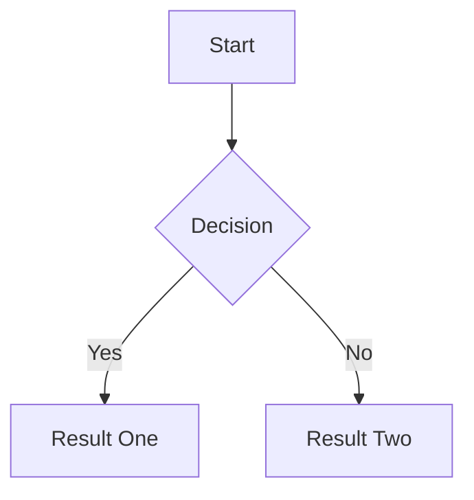

# FAQ

## Contents

- [How do I enable Markdown in my notes?](#how-do-i-enable-markdown-in-my-notes)
- [How do I enable Mermaid diagrams in my notes?](#how-do-i-enable-mermaid-diagrams-in-my-notes)
- [How do I edit several todos at once?](#how-do-i-edit-several-todos-at-once)
- [What is a temporary board?](#what-is-a-temporary-board)
- [What does the done lane mean for dashboard stats?](#what-does-the-done-lane-mean-for-dashboard-stats)
- [Are tag colors personal, or shared with the team?](#are-tag-colors-personal-or-shared-with-the-team)
- [How do I use Scrumboy with Claude or other MCP clients?](#how-do-i-use-scrumboy-with-claude-or-other-mcp-clients)
- [My Claude or Cursor MCP connection broke after upgrading to 3.22 — what do I do?](#my-claude-or-cursor-mcp-connection-broke-after-upgrading-to-322--what-do-i-do)
- [Can Scrumboy MCP OAuth work with OIDC-only login?](#can-scrumboy-mcp-oauth-work-with-oidc-only-login)
- [Can one account use both a Scrumboy password and SSO?](#can-one-account-use-both-a-scrumboy-password-and-sso)
- [What happens if the SSO provider is unavailable?](#what-happens-if-the-sso-provider-is-unavailable)
- [What are VAPID keys, and do I need them?](#what-are-vapid-keys-and-do-i-need-them)
- [How do I generate SCRUMBOY_ENCRYPTION_KEY?](#how-do-i-generate-scrumboy_encryption_key)
- [Do I need to configure SMTP? What happens if I don't?](#do-i-need-to-configure-smtp-what-happens-if-i-dont)
- [I configured SMTP - why don't I see Forgot your Scrumboy password?](#i-configured-smtp---why-dont-i-see-forgot-your-scrumboy-password)
- [How do I turn on email notifications?](#how-do-i-turn-on-email-notifications)
- [How does auditing work, and where can I see it?](#how-does-auditing-work-and-where-can-i-see-it)
- [Does Scrumboy use telemetry, tracking, or “phone home”?](#does-scrumboy-use-telemetry-tracking-or-phone-home)
- [What do I need to do to contribute?](#what-do-i-need-to-do-to-contribute)
- [How do I contact the developers of Scrumboy?](#how-do-i-contact-the-developers-of-scrumboy)
- [Does this project accept donations?](#does-this-project-accept-donations)

# Notes

## Can one account use both a Scrumboy password and SSO?

Yes. Accounts may be local-only, SSO-only, or dual-authentication. An SSO-only user can choose **Set Scrumboy password** after fresh SSO reauthentication. A local user can choose **Connect SSO**, confirm the current Scrumboy password and Scrumboy 2FA when enabled, then authenticate at the provider. The verified provider email must match the canonical Scrumboy email.

Normal SSO login identifies an existing account only by provider issuer and subject. A matching email never silently links an identity or transfers account ownership. See [`docs/oidc.md`](docs/oidc.md).

## What happens if the SSO provider is unavailable?

Existing Scrumboy sessions may continue until they expire or are revoked. New SSO sign-ins and sensitive SSO step-up operations fail until the provider returns. A dual-authentication owner can use the local form when local authentication is enabled.

If no owner has an effective local method, a host operator must stop Scrumboy, back up the SQLite database/volume, and run `scrumboy recover-owner --email owner@example.com`. Recovery revokes the owner's sessions, does not clear 2FA, and does not automatically enable local authentication. Follow [`docs/recovery.md`](docs/recovery.md).
## How do I enable Markdown in my notes?

Set `SCRUMBOY_MARKDOWN_NOTES_ENABLED=1` on the server (also accepts `true`, `on`, or `yes`; case-insensitive). The feature defaults to off.

After a restart, the todo dialog **Notes** field shows **markdown** and **preview** tabs. **markdown** is the source editor; **preview** is a sanitized rendered view. Supported syntax includes headings, emphasis, lists, blockquotes, inline and fenced code, horizontal rules (`---` on its own line with blank lines around it), and safe `http`/`https` links.

Notes are still stored as raw markdown in `todos.body`. Todo titles and board card titles stay plain text. The server exposes `markdownNotesEnabled` on `/api/auth/status` so the UI only enables preview when the server has opted in.

Preview hardening: HTML in notes is not rendered; images stay as escaped text; dangerous link schemes and embedded content are stripped or neutralized.

For architecture, security, and source references, see [`docs/markdown-and-mermaid.md`](docs/markdown-and-mermaid.md).

## How do I enable Mermaid diagrams in my notes?

Mermaid is a **sub-feature of Markdown preview**. You need Markdown preview enabled first (`SCRUMBOY_MARKDOWN_NOTES_ENABLED=1`), then set **`SCRUMBOY_MERMAID_NOTES_ENABLED=1`** on the server (same truthy values: `1`, `true`, `on`, or `yes`; case-insensitive). Turning on Mermaid alone does nothing if Markdown preview is off.

After a restart, fenced **` ```mermaid `** blocks in a todo note render as diagrams when you open the **preview** tab. Regular Markdown in the same note still works; non-Mermaid fenced code blocks stay as code.

Example:

````markdown

````

Mermaid does **not** render on board cards, notifications, exports, or server responses. Notes are still saved as raw text in `todos.body`.

Preview limits (per note): up to **4** Mermaid blocks, **4000** characters per block, and **8000** characters total Mermaid source. Over-limit or syntax errors show a local warning with the original source instead of breaking the whole preview.

Diagrams follow the app’s light/dark theme in preview. Optional yes/no-style branch **label backgrounds** (green/red for pairs like yes/no) can be customized via `/mermaid-semantic-edges.json`; override with `$DATA_DIR/mermaid-semantic-edges.json` (see `data/mermaid-semantic-edges.json.example`).

User-authored Mermaid `%%{init: ...}%%` directive blocks are stripped before render so site security settings stay authoritative. Mermaid runs in **strict** mode (inline SVG in the preview pane only).

The server exposes `mermaidNotesEnabled` on `/api/auth/status` alongside `markdownNotesEnabled`.

For full architecture and security details, see [`docs/markdown-and-mermaid.md`](docs/markdown-and-mermaid.md).

# Board

## How do I edit several todos at once?

On the board, hold **Ctrl** (Windows/Linux) or **⌘ Command** (Mac) and click todo cards to select them. Selected cards are highlighted. When at least two are selected, a bar appears with **Edit N selected** - click it to open the bulk edit dialog.

In that dialog, turn on only the changes you want (each field has its own checkbox), then click **Apply**. Updates apply to the selected todos only - not the whole board. Tags you add are merged onto each card; they do not remove existing tags.

A normal click on a card (without Ctrl/⌘) opens the usual single-todo editor and clears the selection. Viewers cannot use multi-select; Ctrl/⌘+click still opens one todo for them.

## What is a Temporary Board?

Scrumboy has three kinds of board, distinguished by two columns (`expires_at` and `creator_user_id`):

- **Anonymous Board** - an expiring board with **no recorded creator** (`expires_at` set, `creator_user_id` null). Pastebin-style: anyone with the link can use it, and it **cannot be claimed**.
- **Temporary Board** - an expiring board **attributed to the signed-in user who created it** (`expires_at` set, `creator_user_id` set). Shareable by link while temporary, and claimable **only by that creator**.
- **Durable Project** - a normal, **non-expiring** project (`expires_at` unset) governed by owner/member roles. It is **not** publicly accessible just by knowing the slug.

**How you get one**

- Open **`/anon`** (or **`/temp`**, which redirects there). Scrumboy creates a new expiring board and sends you to **`/{slug}`** - that link is how you share it.
- In **Anonymous Mode** (`SCRUMBOY_MODE=anonymous`), the instance has no users; **Anonymous Mode is built for Anonymous Boards only**, so `/anon` always creates an **Anonymous Board**.
- In **Full Mode while signed out**, `/anon` also creates an **Anonymous Board** (no creator).
- In **Full Mode while signed in**, `/anon` creates a **Temporary Board** attributed to you (`creator_user_id` = your user).

**Claiming (Temporary Board → Durable Project)**

- Only the **recorded creator** of a Temporary Board can claim it: `POST /api/board/{slug}/claim` while signed in as that creator. Claiming clears `expires_at`, makes you the owner, and grants you maintainer membership.
- **Anonymous Boards cannot be claimed** - there is no creator to authorize the conversion - and the claim route is **disabled entirely in Anonymous Mode**.
- Another signed-in user who merely has the link **cannot** claim your Temporary Board; they receive **not found**.
- After a successful claim the board becomes a **Durable Project**: the **slug is retained**, but it **stops granting public access**. From then on access requires **ownership or membership** - an unrelated authenticated user, or an unauthenticated visitor, requesting the same slug receives **404**. Because it is no longer temporary, a **repeat** `POST /api/board/{slug}/claim` also returns **not found**.

**Using an Anonymous Board** (`expires_at` set, `creator_user_id` null) works **without signing in**. Anyone with the link can create, edit, move, and delete todos and rename the board. They cannot assign todos to users, change the project image, or delete the whole project from the UI. Tag colors on that board are shared for everyone on the link.

**When it expires**

- New expiring boards (Temporary and Anonymous Boards) start with **`expires_at` about 90 days ahead** (`TemporaryBoardLifetimeDays` in the server code).
- **Yes, activity resets the expiry window** - but not as a separate “inactivity counter.” When the board is used, the server runs **`UpdateBoardActivity`**, which sets **`expires_at` to about 90 days from that moment** (rolling lifetime). Qualifying activity includes loading the board (for example a full board read) and todo changes (create, update, move, delete). Updates are **throttled to at most once every 5 minutes** per board so rapid refreshes do not hammer the database.
- After **`expires_at` has passed**, the board URL returns **404** for reads and edits until the server removes the expired row. There is no “grace period” in the API after expiry.

**Compared to a Durable Project**

| | Expiring board (Temporary / Anonymous) | Durable Project |
|--|-----------------|-----------------|
| Lifetime | `expires_at` (90-day rolling window with activity) | No expiry |
| Sharing | Link-based; Anonymous Boards need no login | Members and roles |
| Claimable | Temporary Boards, by their creator only; Anonymous Boards never | n/a (already durable) |
| Delete project | Not offered for Anonymous Boards | Maintainers can delete |

For permissions detail, see [`docs/roles-and-permissions.md`](docs/roles-and-permissions.md).

# Dashboard

## What does the done lane mean for dashboard stats?

Each project has **exactly one workflow lane marked as done** (in **Settings → Workflow**, the radio on the rightmost lane). That lane can be named anything (for example **Done** or **Shipped**); what matters is the **done** flag on the column, not the display name.

**When you move a todo into the done lane**, Scrumboy records **`done_at`** (the completion time). That timestamp is set the **first** time a todo enters a done lane and is **not cleared** if you move it back out later.

The dashboard uses that lane flag and timestamp like this:

| What you see | Rule |
|--------------|------|
| **Your todo list** on the dashboard | Assigned todos **not** in the done lane |
| **WIP**, **assigned** counts, **workload** | Same: anything assigned and **not** in the done lane |
| **WIP split** (In progress vs Testing) | Only when the project still uses the default lane keys **`doing`** and **`testing`**. Custom workflows show a single WIP total |
| **Sprint completion** (you and team) | Todos in the **active sprint**; **done** = currently in the done lane **and** `done_at` falls between the sprint’s start and end |
| **Throughput** (last four weeks) | `done_at` in each calendar week (your timezone), while the todo is in the done lane |
| **Avg. lead time** | `created_at` → `done_at` for completed todos in the done lane (sprint window when a sprint is active; otherwise roughly the last 30 days) |

So dashboard “done” means **in the project’s designated done lane**, with completion time tracked via **`done_at`**. A todo sitting in **Review** or **Testing** counts as **WIP** until it reaches that done lane, even if you consider it finished informally.

# Tags

## Are tag colors personal, or shared with the team?

It depends on the kind of tag.

**Your personal tags** (tags you create and reuse across projects) keep a **color per user**. If you and a teammate both use a tag named `bug`, each of you can pick a different color in **Settings → Tag Colors**, and you will each see your own choice on cards and filter chips. The app remembers your colors when you sign in.

**Tags that belong to a specific board** (common on shared or anonymous boards) have **one color for everyone** on that board. When a maintainer sets the color, everyone sees the same tint on filter chips and todo cards.

When you open a board, Scrumboy refreshes colors from that board so what you see matches the rules above. Changing a color in **Settings → Tag Colors** saves it for next time and updates the board you have open. If something still looks wrong after a change, refresh the page or reopen the board so the latest colors load.

# Integrations

## How do I use Scrumboy with Claude or other MCP clients?

Scrumboy exposes an **MCP-compatible HTTP API** on the instance you run. AI assistants and automation (Claude, Cursor, custom agents, scripts) can list and call tools to manage projects, todos, sprints, tags, members, and board snapshots — without using the web UI for every change.

**Canonical endpoint for native MCP clients (Claude Code, Cursor, and similar):** `https://YOUR_HOST/mcp/rpc`

Configure the client with that exact URL, for example:

```sh
claude mcp add --transport http scrumboy https://YOUR_HOST/mcp/rpc
```

That surface speaks **JSON-RPC 2.0** (`initialize`, `ping`, `tools/list`, `tools/call`) over Streamable HTTP. It is also the **sole OAuth protected resource**: clients discover Scrumboy’s authorization server from the 401 `WWW-Authenticate` challenge, register via DCR, and send Bearer tokens only to `/mcp/rpc`.

**Legacy envelope (scripts / older integrations):** `POST /mcp` with `{"tool":"…","input":{…}}`. It accepts a session cookie or a static **`sb_…` API token**, not MCP OAuth access tokens.

**Authentication options:**

| Credential | `/mcp/rpc` | `/mcp` |
|------------|------------|--------|
| Session cookie | Yes | Yes |
| Static `sb_…` Bearer | Yes | Yes |
| Scrumboy MCP OAuth access token (bound to `/mcp/rpc`) | Yes | No |

**Important limits today:**

- Scrumboy is an **HTTP** MCP server on your host. It does **not** speak **stdio** MCP (the process-spawn model some desktop apps use). Clients must connect to your Scrumboy base URL over HTTP, or use a bridge that translates stdio to HTTP.
- All traffic stays between the client and **your** Scrumboy server. Scrumboy does not host a cloud MCP relay for you.

For OAuth details see [`docs/oauth.md`](docs/oauth.md). For tool names and examples see [`docs/mcp.md`](docs/mcp.md). For full HTTP behavior see [`API.md`](API.md). Upgrade impact is summarized in [`CHANGELOG.md`](CHANGELOG.md) under **3.22.0**.

## My Claude or Cursor MCP connection broke after upgrading to 3.22 — what do I do?

**3.22** tightened remote MCP OAuth on purpose. If a client that worked on **3.20 / 3.21** suddenly fails, check these in order:

1. **URL must be `/mcp/rpc`, not `/mcp`.**  
   Remove the old server entry and re-add with the canonical path, for example:  
   `claude mcp add --transport http scrumboy https://YOUR_HOST/mcp/rpc`

2. **Clear stale OAuth credentials and authorize again.**  
   Migration `057` invalidates pre-3.22 authorization codes and access/refresh tokens. DCR client registrations remain; you still need a fresh browser consent. Cookies and static `sb_…` tokens are unaffected.

3. **Do not expect an OAuth token to work on `/mcp` or Agora.**  
   Those surfaces stay cookie / static-token only. Native clients use `/mcp/rpc` only.

4. **Confirm the client speaks a supported protocol version** (`2025-03-26`, `2025-06-18`, or `2025-11-25`) and sends `clientInfo.name` **and** `clientInfo.version` on `initialize`.

Details: [`CHANGELOG.md`](CHANGELOG.md) (**3.22.0 → Breaking / upgrade impact**), [`docs/oauth.md`](docs/oauth.md), [`docs/mcp-oauth-acceptance.md`](docs/mcp-oauth-acceptance.md).

## Can Scrumboy MCP OAuth work with OIDC-only login?

**Yes.** After the initial owner completes one-time setup through the main app, an OAuth authorization page can continue through configured SSO and return you to the pending consent request. See [`docs/oauth.md`](docs/oauth.md) for configuration, security behavior, and limitations.

# Notifications

## What are VAPID keys, and do I need them?

**Usually no.** VAPID keys are optional server credentials for **Web Push** - background alerts when someone **assigns you a todo** while the app is closed or in the background (best with an installed PWA). Boards, SSE live updates, and normal use work fine without them.

**Two different notification paths:**

| Setting / feature | What it does |
|-------------------|--------------|
| **Enable notifications** (Settings) | In-tab / desktop alerts while the browser still has Scrumboy open (Notification API) |
| **Web Push** (needs VAPID on the server) | Can reach you when the tab is in the background or the PWA is not focused; uses the browser’s push service (e.g. Apple or Google) |

Do not confuse them: turning on desktop notifications does **not** replace VAPID, and setting VAPID does **not** bypass the browser permission prompt.

**If you want background assignment push**, set **both** on the server:

- `SCRUMBOY_VAPID_PUBLIC_KEY`
- `SCRUMBOY_VAPID_PRIVATE_KEY`

(URL-safe base64 from a VAPID generator — a **matching** pair.) Non-empty strings alone are not enough: the keys must decode to a valid matching P-256 pair, the optional subscriber must be valid (or unset for the default), and the server must run in **full mode**. When push is **effectively enabled** (`pushConfigured: true` / `push.state: "enabled"` on signed-in auth status), signed-in clients may try to subscribe automatically; each user must still **allow notifications** in the browser. **Settings → Customization → Web Push** can turn push off or back on per device.

Optional: `SCRUMBOY_VAPID_SUBSCRIBER` is a **contact hint for push providers** (plain email or `mailto:` / `https:` URL). It does **not** control who can sign in and does not need to match OIDC or user emails.

**Not telemetry:** VAPID identifies **your** Scrumboy server to the push network so assignment events can be delivered. It is not product analytics and does not send board data to Scrumboy’s project maintainers. Assignment push payloads do include the **todo title** (and project slug / todo id) in the encrypted Web Push body — see [`docs/vapid.md`](docs/vapid.md#what-gets-sent-and-what-does-not).

For enablement validation, status/reason fields, key generation, and verification, see [`docs/vapid.md`](docs/vapid.md). For PWA install, Docker wiring, and auto-subscribe behavior, see [`docs/pwa.md`](docs/pwa.md).

## How do I generate SCRUMBOY_ENCRYPTION_KEY?

`SCRUMBOY_ENCRYPTION_KEY` is a **base64-encoded 32-byte** secret you generate yourself. Scrumboy uses it for 2FA and password-reset tokens. It is **not** required for basic startup, but it **is** required for self-service password-reset email (with SMTP) and for setting up 2FA. Generate it **on your own machine** - do not use a random website to create production secrets.

### Linux / macOS

In a terminal:

```bash
openssl rand -base64 32
```

Put the one-line output into the process environment (example):

```bash
export SCRUMBOY_ENCRYPTION_KEY='paste-the-openssl-output-here'
```

Your process manager, Compose file, or systemd unit must inject the same value when Scrumboy starts. The server does **not** auto-load `.env` files.

### Windows

**Option A - PowerShell (no extra software):** open PowerShell and run:

```powershell
[Convert]::ToBase64String((1..32 | ForEach-Object { [byte](Get-Random -Maximum 256) }))
```

Copy the one-line result. For a manual env var in that same session before you start Scrumboy:

```powershell
$env:SCRUMBOY_ENCRYPTION_KEY = 'paste-the-output-here'
```

**Option B - official helpers:** `win_run_full.bat` / `win_run_anonymous.bat` can create and store a key in `data/scrumboy.env` (format `SCRUMBOY_ENCRYPTION_KEY=<base64…>`) and inject it for you. See [`README.md`](README.md#encryption-key-optional).

If OpenSSL is installed on Windows, `openssl rand -base64 32` works the same as on Linux.

### After you have a key

- Back it up **with** `data/app.db`. Losing or replacing the key after 2FA or password-reset data exists can break those features.
- Do **not** regenerate the key casually on an instance that already uses encrypted auth data.
- More detail: [`README.md`](README.md#encryption-key-optional) and [`docs/smtp.md`](docs/smtp.md#required-env-vars) (SMTP needs this key among others).

## Do I need to configure SMTP? What happens if I don't?

**No.** SMTP is optional server config for self-service password-reset email delivery. Without it, admins can still generate password-reset links manually (Settings → Users → Password) and hand them to the user out of band - that flow is unaffected by SMTP configuration.

To let users who already have a local password request their own reset email, configure `SCRUMBOY_SMTP_HOST`, `SCRUMBOY_SMTP_FROM`, `SCRUMBOY_ENCRYPTION_KEY`, and a valid `SCRUMBOY_PUBLIC_BASE_URL`, and keep local authentication enabled. Users can then choose **Forgot your Scrumboy password?**. SSO-only accounts use provider recovery and receive no Scrumboy reset mail; owners can generate a link only for accounts with a usable local password. The generic request response does not confirm an account or delivery. See [`docs/smtp.md`](docs/smtp.md).

## I configured SMTP - why don't I see Forgot your Scrumboy password?

Setting the SMTP host alone is not enough. Scrumboy only shows **Forgot your Scrumboy password?** when self-service reset is fully ready, local authentication is enabled, and you are on the local-password sign-in screen. Work through this checklist:

1. **Full mode** - anonymous mode never offers self-service reset (`selfServicePasswordResetEnabled` is always `false`).
2. **Startup logs** - look for `smtp: enabled (host=… port=…)`. Do **not** stop there: also confirm there is **no** `SCRUMBOY_PUBLIC_BASE_URL is missing or invalid…` line and **no** `invalid SCRUMBOY_ENCRYPTION_KEY ignored… password reset disabled` warning. You need all four: `SCRUMBOY_SMTP_HOST`, `SCRUMBOY_SMTP_FROM`, `SCRUMBOY_ENCRYPTION_KEY`, and a valid `SCRUMBOY_PUBLIC_BASE_URL` (see [`docs/smtp.md`](docs/smtp.md#required-env-vars)).
3. **`GET /api/auth/status`** - `selfServicePasswordResetEnabled` must be `true`. That flag is the source of truth for whether the SPA will offer the control (it does not prove mail can reach your relay).
4. **Local password sign-in** - the control is hidden during first-time bootstrap, when local auth is disabled (OIDC-only), and when you are not on the email+password form.

If the capability is `true` but mail never arrives after you submit an address, that is a delivery/credentials issue (try `SCRUMBOY_SMTP_DEBUG=1`), not this UI gate. Admins can still generate a reset link under Settings → Users → Password. Full setup details: [`docs/smtp.md`](docs/smtp.md).

## How do I turn on email notifications?

Email notifications reuse the same SMTP config as self-service password reset (`SCRUMBOY_SMTP_HOST`, `SCRUMBOY_SMTP_FROM`, `SCRUMBOY_PUBLIC_BASE_URL`), but do **not** need `SCRUMBOY_ENCRYPTION_KEY`. Once the server reports `emailNotifyAvailable: true` on `GET /api/auth/status`, each user opts in individually under Settings → Customization: a master toggle (off by default) plus five category checkboxes (card assigned to me and added to a project default on; card/sprint/project activity default off). No email sends unless both the master toggle and the relevant category are on for that user. See [`docs/notifications.md`](docs/notifications.md) for the full category/recipient breakdown.

# Auditing

## How does auditing work, and where can I see it?

Scrumboy **records an audit trail automatically** while you use the product. There is nothing to turn on in Settings and no separate “audit mode.” When maintainers and contributors create or change todos, members, projects, or todo links, the server appends a row to the **`audit_events`** table in your SQLite database (typically under your `data` directory).

**What is logged** (per project) includes, among others:

- Todo created, updated, moved, or deleted
- Members added, removed, or role changes
- Project created, renamed, image updated, default sprint weeks changed, or deleted
- Todo links added or removed

Each event stores **who** did it (`actor_user_id`, or NULL on anonymous boards), **what** happened (`action`), **which entity** (`target_type` / `target_id`), and **JSON metadata**. Metadata varies by action: some events store full user-provided strings (todo titles on create, project names on create/rename/delete, tag names in tag diffs); title/body **updates** store lengths only; note bodies are never stored in audit metadata. Rows are **append-only** at the application level (database triggers reject ordinary updates and deletes on `audit_events`; that is not a guarantee against privileged database or filesystem access).

**Assignee changes** are tracked separately in **`todo_assignee_events`**, not duplicated in `audit_events`.

**Where to view it today:** there is **no audit log screen in the web UI** and **no public HTTP API** to list events yet (planned for the future). To review history now, query the database directly, for example:

```sql
SELECT created_at, action, actor_user_id, target_type, target_id, metadata
FROM audit_events
WHERE project_id = ?
ORDER BY created_at DESC
LIMIT 50;
```

JSON project backups/exports do **not** include `audit_events`. Keep a file-level `DATA_DIR` backup if you need the audit table for disaster recovery.

For the full action list, metadata disclosure table, and security notes, see [`docs/audit-trail.md`](docs/audit-trail.md).

# Privacy

## Does Scrumboy use telemetry, tracking, or “phone home”?

**No.** Scrumboy does not ship product analytics, ad trackers, or background reporting to the Scrumboy project or any other vendor. Your boards, todos, tags, and account data stay on **the server you run** (typically a local SQLite database under your data directory).

Normal use only talks to **your own Scrumboy instance** - the web app loading pages and calling its API on the same host. There is no built-in usage statistics collection.

A few **optional** features can reach **other systems you control or enable**:

- **Sign-in (OIDC/SSO)** - only if you configure it; the browser talks to *your* identity provider, not Scrumboy’s servers.
- **Webhooks** - only if you add them; Scrumboy sends events to URLs *you* choose.
- **Desktop / PWA notifications** - only if you turn them on and the server has push keys configured; the browser’s push service (e.g. Apple or Google) delivers alerts, which is standard for web apps and not Scrumboy “spying.”
- **Integrations (API, MCP, automation)** - only when you or your tools call your instance.

Words like “analytics” or “activity” inside Scrumboy (for example dashboard stats or audit history) refer to **features that read your own database**, not third-party tracking.

If you self-host, you are responsible for your deployment’s network exposure, backups, and any optional integrations above. The application source is available to inspect under the project license.

# Contributing

## What do I need to do to contribute?

Fork the repo, make your changes on a branch, and open a pull request. For setup, tests, and PR expectations, see [`CONTRIBUTING.md`](CONTRIBUTING.md).

When you commit, add the **`-s`** flag so Git records a **Signed-off-by** line (Developer Certificate of Origin). That is what our CI checks on pull requests.

Example:

```bash
git commit -s -m "Fix board filter chip styling"
```

You do **not** need to sign a separate CLA, email a form, or use any other signing service. The **`-s`** on your commits is enough.

## How do I contact the developers of Scrumboy?

Email **[markraidc@gmail.com](mailto:markraidc@gmail.com)**. For bugs and feature work, prefer a GitHub issue or pull request on the project repository when you can; use email for other inquiries.

## Does this project accept donations?

Yes. If you find Scrumboy useful and want to support development, you can use [Buy Me a Coffee](https://buymeacoffee.com/markrai). Donations are optional and appreciated - they are not required to use the software.
