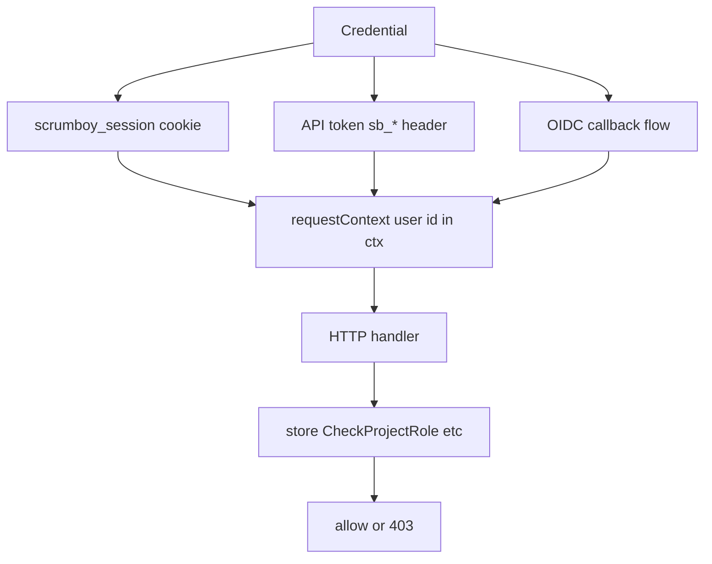
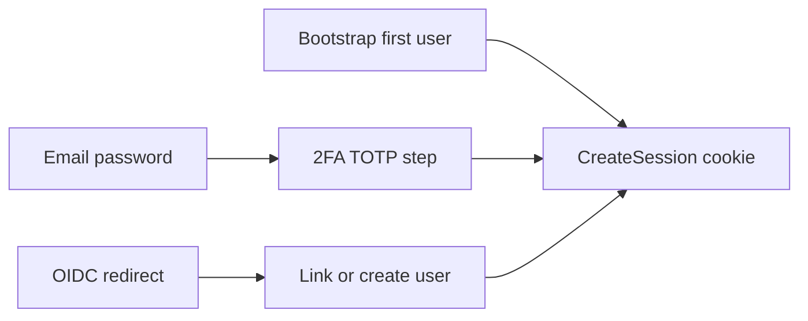

# Authentication and permissions

Two-layer model: HTTP establishes actor identity; `store` enforces system and project roles.

## Login paths

- **Full mode:** sessions, users, API tokens, admin routes
- **Anonymous mode:** `requestContext` ignores cookies; temp boards have no owner until claimed
- **2FA:** requires `SCRUMBOY_ENCRYPTION_KEY` once encrypted auth/security data exists (TOTP and/or password-reset tokens)
- **Pre-auth locale picker:** auth shell (sign-in, bootstrap, 2FA, password reset) exposes the shared public locale listbox in the topbar; copy comes from the i18n bootstrap catalog until the full locale JSON loads.
- **Post-login redirect:** bootstrap, login, and 2FA completion redirect via sanitized `next` from auth state (strips stale OIDC query noise).

See `docs/roles_and_permissions.md` for role matrix detail.
