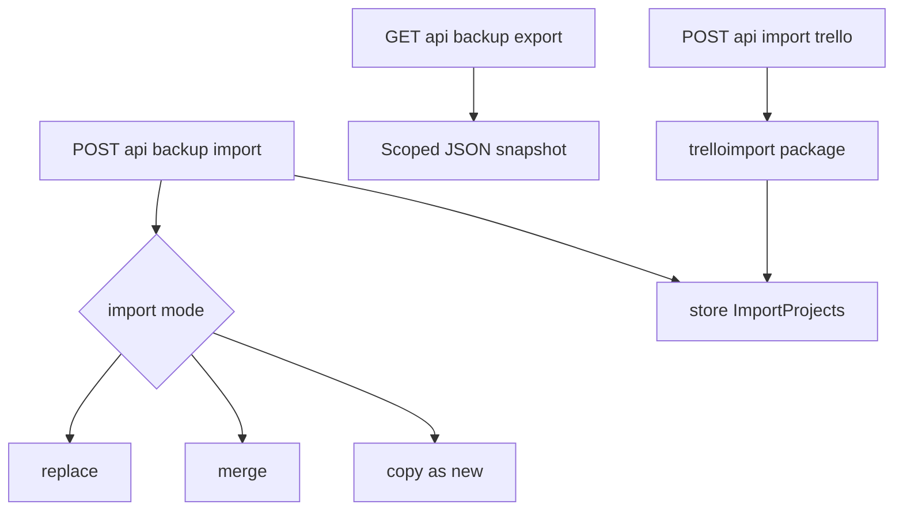
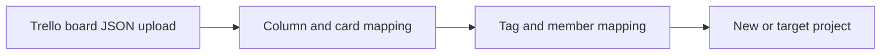

# Backup and import

Project export and restore plus Trello JSON import.

## Trello transform

Import body size is capped separately (`MaxTrelloImportBody`). Audit trail records destructive import operations when enabled.
