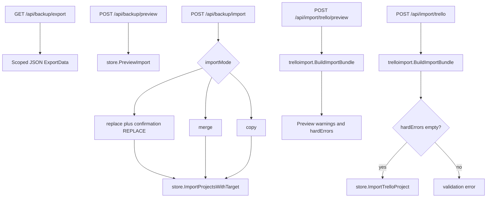
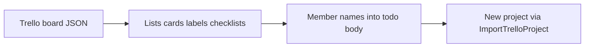

# Backup and import

Project export/restore and Trello JSON import use separate HTTP and store paths.

Native backup: preview via `PreviewImport`; mutate via `ImportProjectsWithTarget` (`replace` / `merge` / `copy`). Replace requires `confirmation: "REPLACE"`.

Trello import uses dedicated `ImportTrelloProject` (not the generic `ImportProjects` path). Preview and import both use `trelloimport.BuildImportBundle`. Import rejects when preview `hardErrors` is non-empty. Body size is capped separately (`MaxTrelloImportBody`).

## Trello transform

Trello members do **not** become Scrumboy assignees automatically; member information is preserved in note text where applicable (see Trello import warnings).

Backup and Trello import paths do **not** append import audit events. Do not treat imports as audited actions unless product code adds that later.
