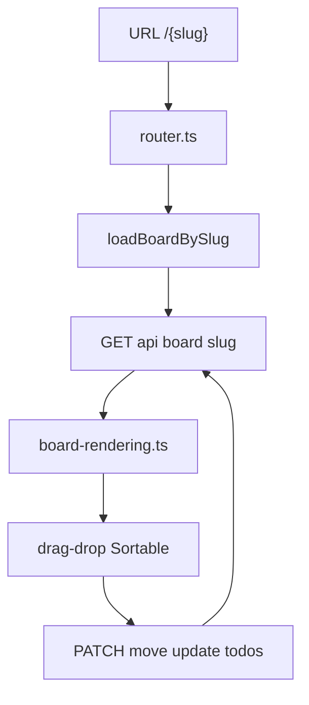
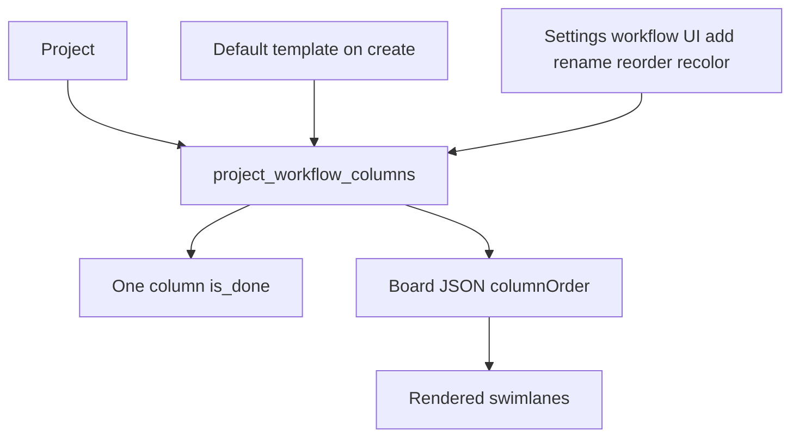
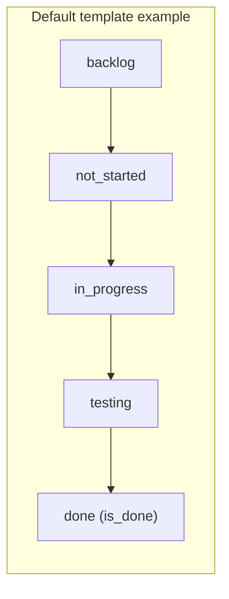

# Board and Kanban UX

Board data flows from slug URL through REST into rendered lanes and drag-drop mutations.

## Workflow columns (per project)

Lanes are **not** hard-coded. Each project stores an ordered list in `project_workflow_columns`: stable `key`, display label, color, sort order, and exactly one `is_done` flag.

Default template keys (example only; boards can diverge):

Projects may add lanes (up to store limit), rename labels, recolor columns, reorder them, and choose which lane counts as done. Todos reference lanes by `column_key`, not a fixed enum.

Lane colors and sprint chips use `styles.css` CSS variables. Sprints filter board scope via `sprintId` query param; tags and search filters apply client-side in `board-filters.ts`. Agile field labels and native `title` hover hints (`field-tooltips.ts`) localize with the active locale.
