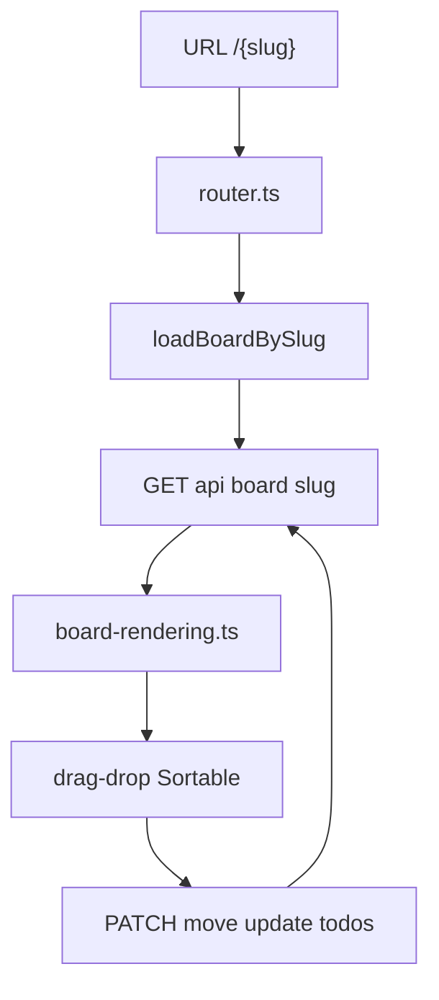
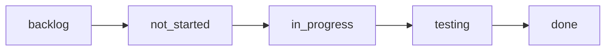

# Board and Kanban UX

Board data flows from slug URL through REST into rendered lanes and drag-drop mutations.

## Workflow columns

Lane colors and sprint chips are defined in `styles.css` CSS variables. Sprints filter board scope via `sprintId` query param; tags and search filters apply client-side in `board-filters.ts`.
