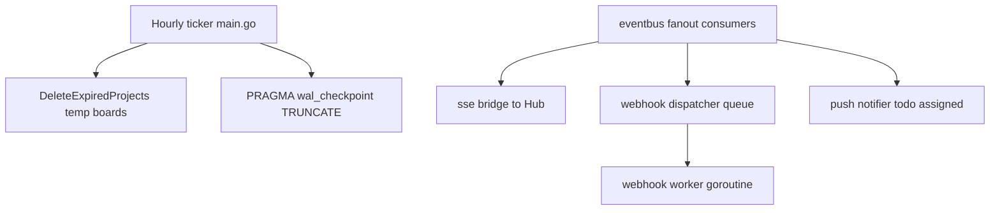

# Application bootstrap

Startup sequence in `cmd/scrumboy/main.go`.

```mermaid
flowchart LR
  Env[config.FromEnv]
  DB[db.Open SQLite]
  Mig[migrate.Apply]
  Key[ResolveStartupEncryptionKey]
  Store[store.New]
  Color[BackfillDominantColors]
  OIDC[oidc.New optional]
  MCP[mcp.New]
  Agora[agora.New]
  Srv[httpapi.NewServer]
  Listen[http.Server Listen TLS optional]

  Env --> DB --> Mig --> Key --> Store --> Color
  Color --> OIDC
  OIDC --> MCP --> Agora --> Srv --> Listen
```

`ResolveStartupEncryptionKey` runs after migrations and before `store.New`. If encrypted auth/security data already exists, an invalid or missing `SCRUMBOY_ENCRYPTION_KEY` fails startup. On a fresh database with no encrypted data, an invalid key is logged and ignored (2FA setup and password-reset encryption stay disabled until a valid key is configured).

## Background work

`NewServer` wires the SSE bridge, webhook queue plus worker, and push notifier into `eventbus.NewFanout` before serving traffic. After `NewServer`, `main.go` calls `st.SetTodoAssignedPublisher(srv.PublishTodoAssigned)` to close the todo-assigned → eventbus loop.

`httpapi.NewServer` also receives feature flags from config: `WallEnabled`, `MarkdownNotesEnabled`, and `MermaidNotesEnabled`.
