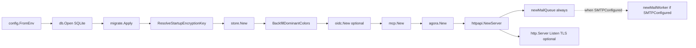
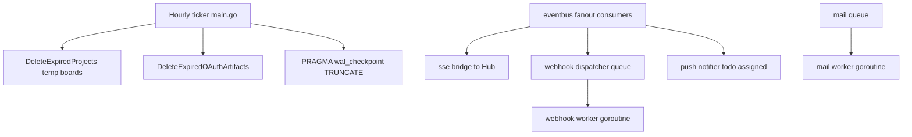

# Application bootstrap

Startup sequence in `cmd/scrumboy/main.go`.

`ResolveStartupEncryptionKey` runs after migrations and before `store.New`. If encrypted auth/security data already exists, an invalid or missing `SCRUMBOY_ENCRYPTION_KEY` fails startup. On a fresh database with no encrypted data, an invalid key is logged and ignored (2FA setup and password-reset encryption stay disabled until a valid key is configured).

`httpapi.NewServer` always creates `newMailQueue`. If `SMTPConfigured(host, port, from)`, it builds `mailer.New`, `newMailWorker`, and starts `mWorker.Run(mailCtx)`.

Shutdown (`main.go`): `http.Server.Shutdown` then `srv.Close(closeCtx)`. `Server.Close` seals webhook and mail queues, begins worker shutdown, cancels accept loops, and waits on `webhookDone` / `mailDone` (bounded by context).

## Background work

Hourly order in `main.go`: `DeleteExpiredProjects` → `DeleteExpiredOAuthArtifacts` → WAL checkpoint.

`NewServer` wires the SSE bridge, webhook queue plus worker, mail queue (and mail worker when SMTP is configured), and push notifier into `eventbus.NewFanout` before serving traffic. After `NewServer`, `main.go` calls `st.SetTodoAssignedPublisher(srv.PublishTodoAssigned)` to close the todo-assigned → eventbus loop.

`httpapi.NewServer` also receives feature flags from config: `WallEnabled`, `MarkdownNotesEnabled`, and `MermaidNotesEnabled`.
