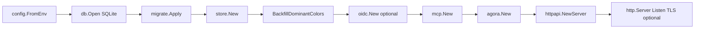
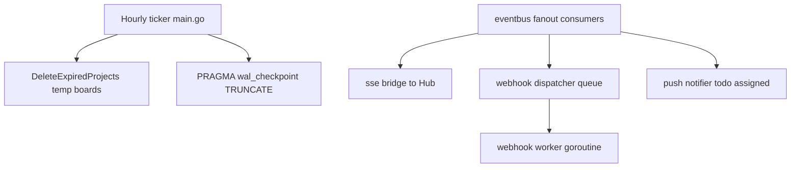

# Application bootstrap

Startup sequence in `cmd/scrumboy/main.go`.

## Background work

`NewServer` wires the SSE bridge, webhook queue plus worker, and push notifier into `eventbus.NewFanout` before serving traffic.
