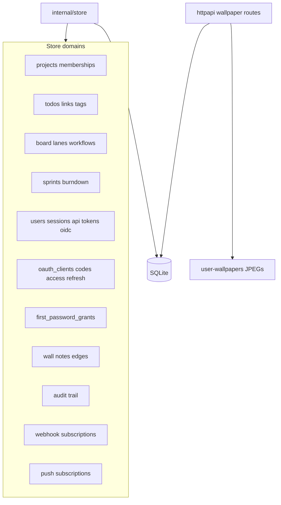
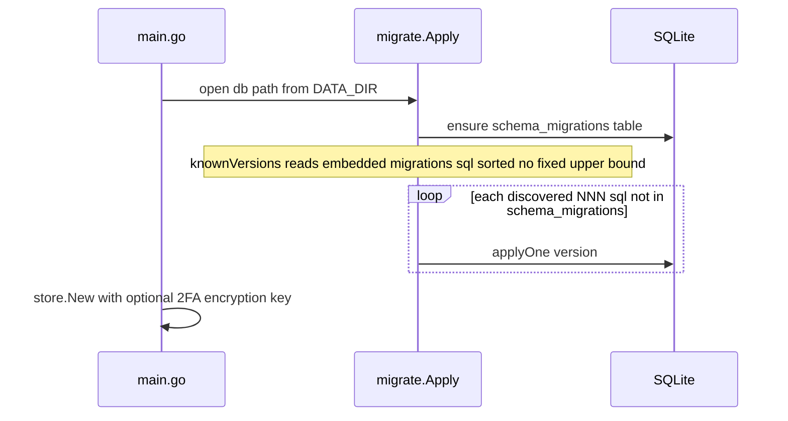

# Data model and persistence

SQLite is the primary store for board, auth, and domain state. Uploaded wallpapers are file-backed under `DATA_DIR/user-wallpapers/` (preference JSON stays in SQLite). `internal/store` owns domain rules; `internal/migrate` applies numbered SQL files discovered from the embedded migrations tree (no fixed upper bound).

Wallpaper preference (`user_preferences` key `wallpaper`) records mode/color/revision in SQLite; the normalized JPEG for image mode lives only on disk at `DATA_DIR/user-wallpapers/<user-id>.jpg`.

OAuth authorization codes and access/refresh tokens (after migration 057) require a non-empty `resource` (canonical MCP audience `<origin>/mcp/rpc`). `oauth_clients` has no resource column. `first_password_grants` references `users(id)` and `sessions(token_hash)`. Expired OAuth artifacts are cleaned by hourly `store.DeleteExpiredOAuthArtifacts`.

## Migration pipeline

As of this tree the highest embedded file is `057_bind_oauth_tokens_to_mcp_resource.sql` (OAuth AS in 055, first-password grants in 056, resource binding in 057). New files under `internal/migrate/migrations/` are applied automatically; do not document a frozen upper bound.

Authorization checks live in store methods (`CheckProjectRole`, system roles), not only in HTTP handlers.
