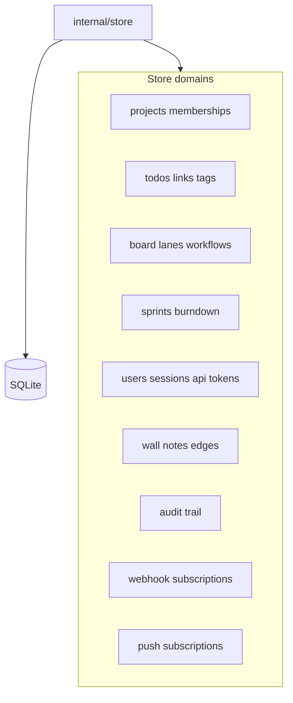
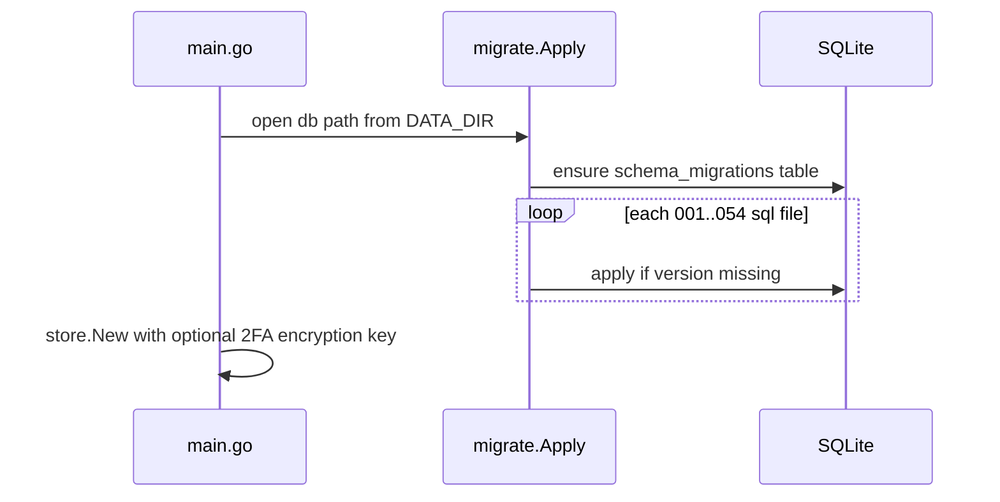

# Data model and persistence

SQLite is the single source of truth. `internal/store` owns domain rules; `internal/migrate` applies numbered SQL files.

## Migration pipeline

Authorization checks live in store methods (`CheckProjectRole`, system roles), not only in HTTP handlers.
