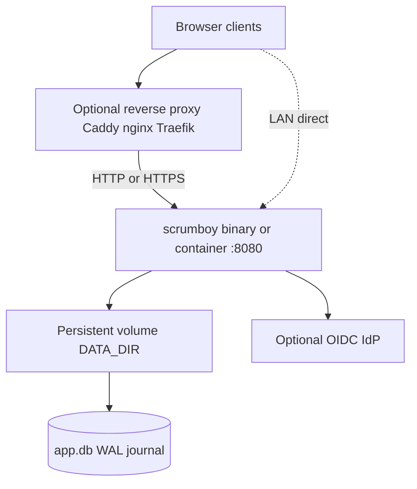
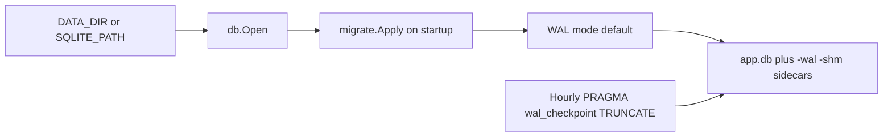
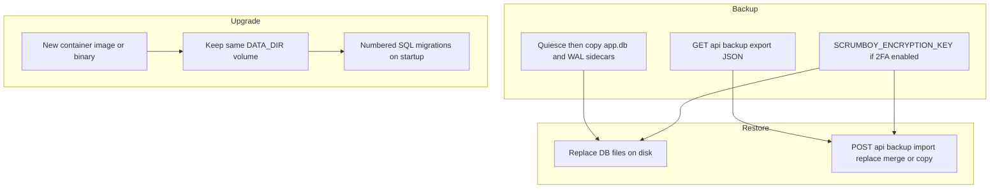

# Deployment and operations

Single-node self-hosting: one process, one SQLite database file, embedded SPA assets. No built-in clustering or HA; run one Scrumboy instance per database.

## Typical topology

- **Docker:** `docker compose up --build` maps `./data:/data` and sets `DATA_DIR=/data`, `SQLITE_PATH=/data/app.db` (see `docker-compose.yml`, `Dockerfile`).
- **TLS:** terminate at the reverse proxy, or enable app TLS when both `SCRUMBOY_TLS_CERT` and `SCRUMBOY_TLS_KEY` exist.
- **Bind:** `BIND_ADDR` defaults to `:8080`.

## SQLite persistence

WAL allows readers during writes but SQLite still has a **single writer**. Do not mount the same database from two running instances.

| Variable | Role |
|----------|------|
| `DATA_DIR` | Directory for `app.db` (default `./data`) |
| `SQLITE_PATH` | Full DB path override (Docker uses `/data/app.db`) |
| `SQLITE_JOURNAL_MODE` | Default `WAL` |
| `SQLITE_SYNCHRONOUS` | Default `FULL` |
| `SQLITE_BUSY_TIMEOUT_MS` | Writer lock wait (Compose sets `5000`) |

## Backup, restore, and upgrade

- **File backup:** stop the process (or ensure no concurrent writes), copy `app.db` and any `-wal` / `-shm` files together.
- **JSON backup:** scoped export via API; import supports replace, merge, or copy-as-new (see `scrumboy_backup_import.md`).
- **2FA:** back up `SCRUMBOY_ENCRYPTION_KEY` with the database; rotating it breaks stored TOTP secrets.
- **Upgrade:** replace the binary or image, keep the data volume, restart; pending migrations apply automatically in `main.go`.

## Operational limits

- One instance per database file (no horizontal scale-out on shared SQLite).
- Suitable for small to medium teams on a single host; heavy concurrent write load is the main bottleneck.
- Optional features (OIDC, VAPID push, webhooks, MCP) add env vars but are not required for core Kanban use.
