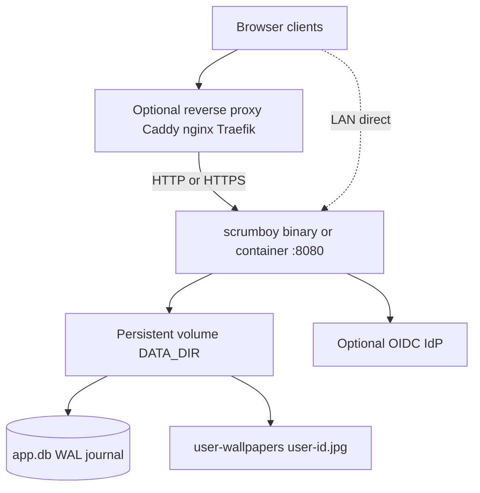
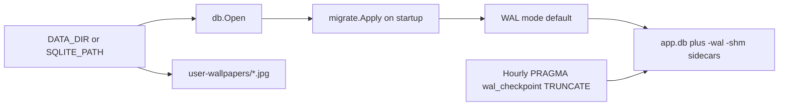
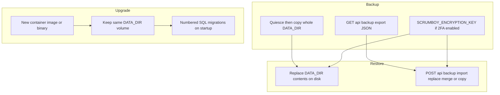

# Deployment and operations

Single-node self-hosting: one process, one `DATA_DIR` volume (SQLite plus file-backed uploads), embedded SPA assets. No built-in clustering or HA; run one Scrumboy instance per database.

## Typical topology

- **Docker (recommended):** pull `ghcr.io/markrai/scrumboy:latest`, publish `:8080`, mount a volume on `/data` (`DATA_DIR=/data`, `SQLITE_PATH=/data/app.db` are image defaults).
- **Docker (local clone):** `docker compose up --build` from the repo maps `./data:/data` (see `docker-compose.yml`, `Dockerfile`).
- **TLS:** terminate at the reverse proxy, or enable app TLS when both `SCRUMBOY_TLS_CERT` and `SCRUMBOY_TLS_KEY` exist.
- **Bind:** `BIND_ADDR` defaults to `:8080`.

## Persistence under DATA_DIR

SQLite holds board, auth, and preference state (including wallpaper preference JSON in `user_preferences`). Uploaded custom wallpaper images are stored as JPEGs at `DATA_DIR/user-wallpapers/<user-id>.jpg` — only the preference is in the database.

WAL allows readers during writes but SQLite still has a **single writer**. Do not mount the same database from two running instances.

| Variable | Role |
|----------|------|
| `DATA_DIR` | Instance data directory for `app.db` and file-backed uploads such as `user-wallpapers/` (default `./data`) |
| `SQLITE_PATH` | Full DB path override (Docker uses `/data/app.db`) |
| `SQLITE_JOURNAL_MODE` | Default `WAL` |
| `SQLITE_SYNCHRONOUS` | Default `FULL` |
| `SQLITE_BUSY_TIMEOUT_MS` | Writer lock wait (Compose sets `5000`) |

### Persistence matrix

What lives where, what JSON export covers, and what a full restore needs. See also [docs/recovery.md](../recovery.md) for owner password recovery (stop service and back up `DATA_DIR` first).

| State | Location | In JSON export | Needed for full restore |
|-------|----------|----------------|-------------------------|
| SQLite | `SQLITE_PATH` (default under `DATA_DIR`) | scoped projects | yes |
| WAL/SHM | beside DB | no | quiesce/copy with DB |
| Wallpapers | `DATA_DIR/user-wallpapers/` | no | yes |
| Encryption key | env/secret (`SCRUMBOY_ENCRYPTION_KEY`) | no | yes if encrypted auth data |
| Mermaid override | `DATA_DIR/mermaid-semantic-edges.json` when used | no | only for that override |

## Backup, restore, and upgrade

- **File backup:** Prefer stopping the process (or otherwise ensuring no concurrent writes), then copy the **entire** `DATA_DIR` (Docker `/data`). That includes `app.db`, any `-wal` / `-shm` sidecars, and `user-wallpapers/`. If you must copy a live database, copy `app.db` together with its WAL/SHM sidecars **and** the `user-wallpapers/` directory — copying only `app.db` is not sufficient. Restoring the database without the wallpaper files leaves image-mode preferences pointing at missing files.
- **JSON backup:** Project-scoped logical export via API; import supports replace, merge, or copy-as-new (see `scrumboy_backup_import.md`). It does **not** include uploaded wallpaper files, general user preferences, or `audit_events`, and is not a substitute for a complete file-level `DATA_DIR` backup.
- **2FA:** back up `SCRUMBOY_ENCRYPTION_KEY` with the database; rotating it breaks stored TOTP secrets. Once encrypted auth/security data exists, startup requires the original valid key. On a fresh install with no encrypted data yet, an invalid key is ignored with a warning (2FA and password-reset encryption stay off until a valid key is set).
- **Owner recovery:** host-side `recover-owner` can establish or replace an owner local password without the IdP; see `docs/recovery.md` (stop the service and back up `DATA_DIR` first).
- **Upgrade:** replace the binary or image, keep the data volume, restart; pending migrations apply automatically in `main.go`.

## Operational limits

- One instance per database file (no horizontal scale-out on shared SQLite).
- Suitable for small to medium teams on a single host; heavy concurrent write load is the main bottleneck.
- Optional features (OIDC, VAPID push, webhooks, MCP, OAuth authorization server, SMTP/password-reset mail, wall canvas, markdown/mermaid notes) add env vars but are not required for core Kanban use.
