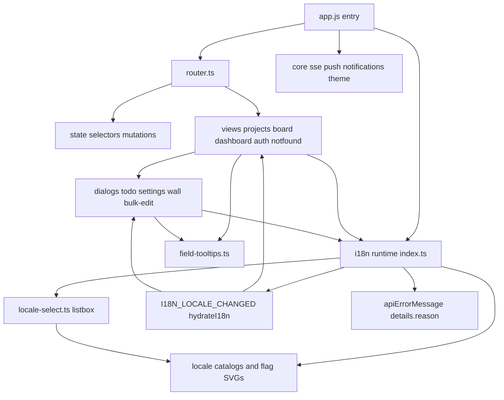
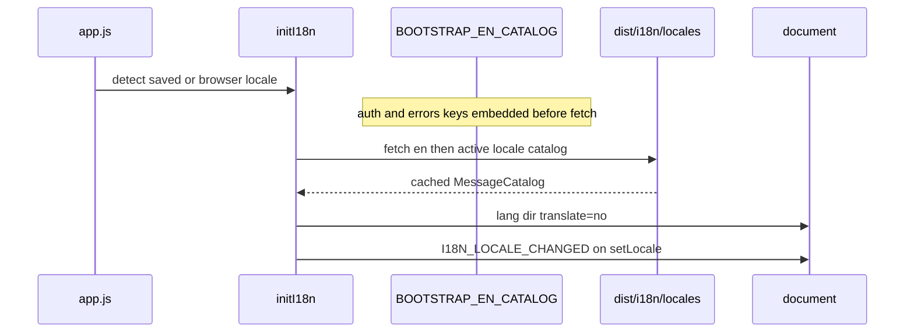

# Frontend SPA shell

Vanilla TypeScript modules compiled to `dist/` and embedded by Go `//go:embed`.

## Locale flow

- `modules/i18n/index.ts` owns locale detection, catalog loading, `t(...)`, `hydrateI18n(...)`, `I18N_LOCALE_CHANGED`, RTL `dir` for `ar` and `ur`, and shared date/number formatting helpers.
- **Public locales** (picker order by speaker count): `en`, `zh`, `hi`, `es`, `ar`, `fr`, `pt`, `id`, `ur`, `ru`, `de`, `ja`, `vi`, `tr`, `ko`, `it`, `th`. **`pseudo`** is supported for localhost/test QA only (not in the public picker).
- Catalogs live in `modules/i18n/locales/*.json`, ship as `dist/i18n/locales/*.json`, and are verified for key parity by `scripts/verify-i18n-locales.mjs` during the web build.
- `BOOTSTRAP_EN_CATALOG` embeds all `auth.*` and `errors.*` keys so sign-in, bootstrap, 2FA, and password-reset copy is available before the full catalog fetch completes.
- **Language picker:** `locale-select.ts` renders a shared accessible listbox (keyboard navigation, click-outside close) with vendored 3x2 SVG flags from `assets/flags/`. Used on the auth topbar and in Settings → Customization.
- On startup the app uses the saved `scrumboy.locale` preference when present; otherwise it normalizes the browser language.
- Locale changes hydrate static `data-i18n-*` DOM in place and trigger targeted re-renders for state-derived copy in views and dialogs that stay open; listeners must detach on dialog close.
- **`index.html`** marks the shell `translate="no"` so browser translation does not double-translate Scrumboy's own i18n UI.

## API error localization

- Backend validation failures may include stable `error.details.reason` (snake_case). `apiErrorMessage()` maps known reasons to catalog keys; `apiErrorMessageOrRaw()` keeps raw backend text for dynamic import/backup diagnostics.
- Field hover hints (`field-tooltips.ts`) resolve tooltip copy through `t(...)` at render time.

## Client routes

| Path | View |
|------|------|
| `/` | projects list |
| `/dashboard` | dashboard |
| `/{slug}` | board |
| `/{slug}/t/{id}` | board with todo open |
| `/auth/*` | login bootstrap reset |

`theme.ts` applies dark default (`:root`) or `[data-theme="light"]`; density via `--ui-scale`. PWA: `sw.js` with version injected at server startup, `manifest.json`.
