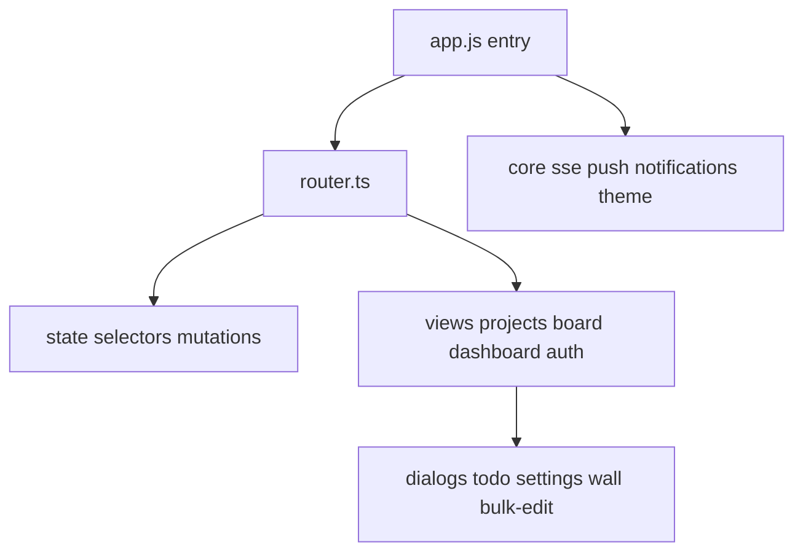

# Frontend SPA shell

Vanilla TypeScript modules compiled to `dist/` and embedded by Go `//go:embed`.

## Client routes

| Path | View |
|------|------|
| `/` | projects list |
| `/dashboard` | dashboard |
| `/{slug}` | board |
| `/{slug}/t/{id}` | board with todo open |
| `/auth/*` | login bootstrap reset |

`theme.ts` applies dark default (`:root`) or `[data-theme="light"]`; density via `--ui-scale`. PWA: `sw.js` with version injected at server startup, `manifest.json`.
