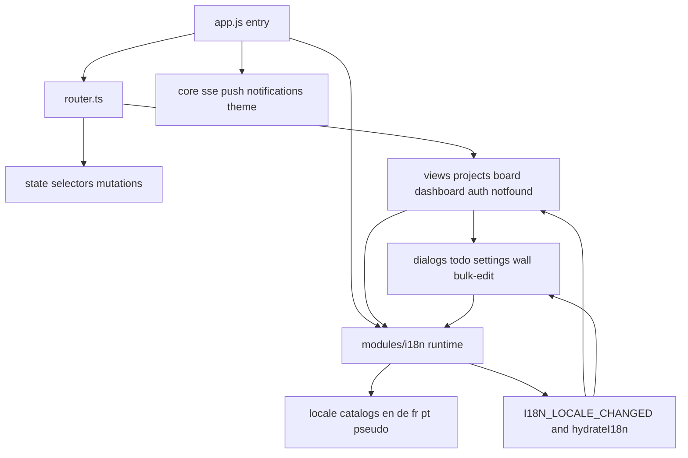

# Frontend SPA shell

Vanilla TypeScript modules compiled to `dist/` and embedded by Go `//go:embed`.

## Locale flow

- `modules/i18n/index.ts` owns locale detection, catalog loading, `t(...)`, `hydrateI18n(...)`, `I18N_LOCALE_CHANGED`, and shared date/number formatting helpers.
- The SPA ships public locale catalogs for `en`, `de`, `fr`, and `pt`, plus `pseudo` for localhost/test QA only.
- On startup the app uses the saved preference when present; otherwise it normalizes the browser language. `Settings -> Language` exposes only the public locales.
- Locale changes hydrate static DOM in place and trigger targeted re-renders for state-derived copy in views and dialogs that keep local state open.

## Client routes

| Path | View |
|------|------|
| `/` | projects list |
| `/dashboard` | dashboard |
| `/{slug}` | board |
| `/{slug}/t/{id}` | board with todo open |
| `/auth/*` | login bootstrap reset |

`theme.ts` applies dark default (`:root`) or `[data-theme="light"]`; density via `--ui-scale`. PWA: `sw.js` with version injected at server startup, `manifest.json`.
