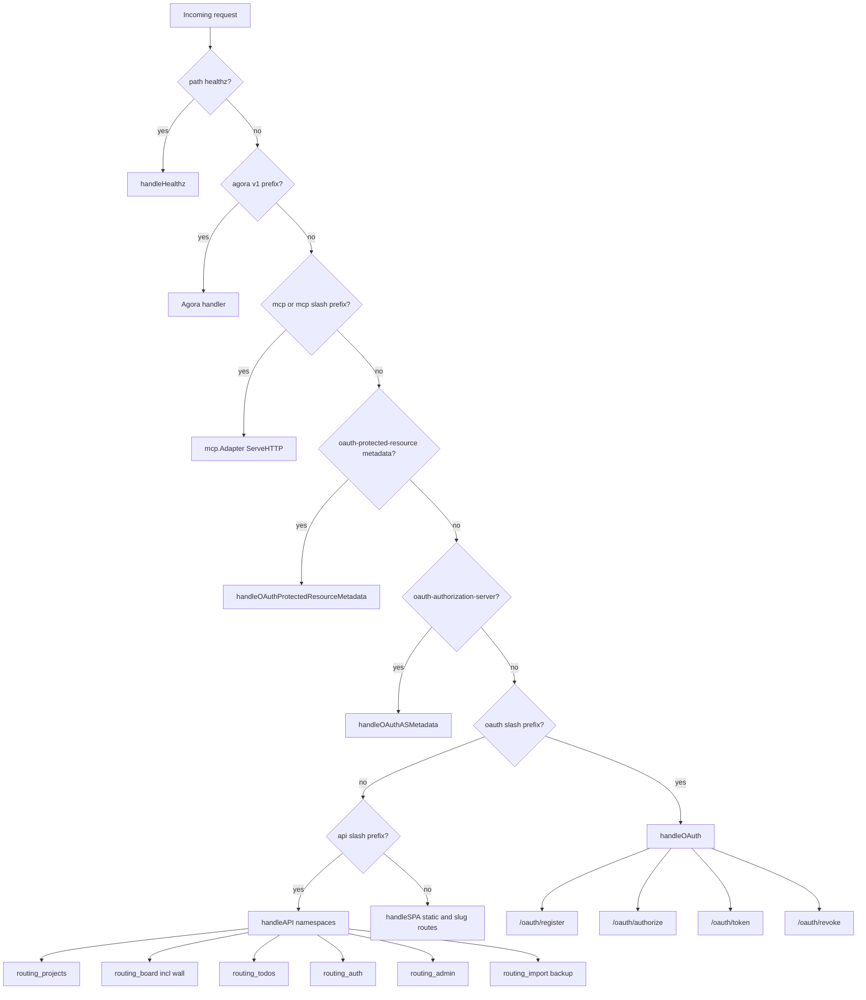

# HTTP request routing

Top-level dispatch in `internal/httpapi/server.go` `ServeHTTP`.

Dispatch order: `healthz` → Agora → MCP → OAuth protected-resource metadata → OAuth authorization-server metadata → `/oauth/*` → `/api/*` → SPA.

OAuth discovery paths include `/.well-known/oauth-protected-resource`, `/.well-known/oauth-protected-resource/mcp/rpc`, and `/.well-known/oauth-authorization-server`. OAuth routes live **outside** `/api/*` (no `X-Scrumboy` CSRF). Full mode only; anonymous mode returns 404 from the OAuth handlers. See [`oauth.md`](../oauth.md).

Wall REST lives under **`/api/board/{slug}/wall`** via `routing_board_wall.go` (nested under board, not a top-level API namespace).

## API namespaces (`routing.go`)

Top-level `/api/*` segments: `projects`, `board`, `todos`, `auth`, `me`, `backup`, `import`, `user`, `admin`, `version`, `tags`, `dashboard`, `webhooks`, `push`.

API lives under `/api/*` only; everything else falls through to embedded `web/dist` assets or slug canonicalization (except the OAuth and MCP/Agora surfaces above).

## SPA paths (`spa.go`)

- `/` marketing landing (anonymous mode) or SPA `index.html` → client projects list (full mode)
- `/dashboard` personal dashboard
- `/{slug}` canonical project board URL
- `/{slug}/t/{localId}` deep link to todo segment
- `/anon` creates anonymous temporary board and redirects to `/{slug}` (**all modes**)
- `/temp` redirects to `/anon`
- `/{locale}/` localized marketing landings (**anonymous mode only**)
- `/p/{id}` legacy redirect to `/{slug}`
- `mermaid-semantic-edges.json` served dynamically (not a static embed)
- `sw.js` version-injected service worker

## Localized validation errors (SPA)

Handlers use `writeValidationError(w, message, reason, details)` with stable snake_case `details.reason` when the failure class is known. The SPA maps recognized reasons through `apiErrorMessage()` / catalog keys; unknown or dynamic store messages keep the English `error.message` (or raw text via `apiErrorMessageOrRaw()` on import/backup paths). HTTP status codes and payload shape are unchanged.
