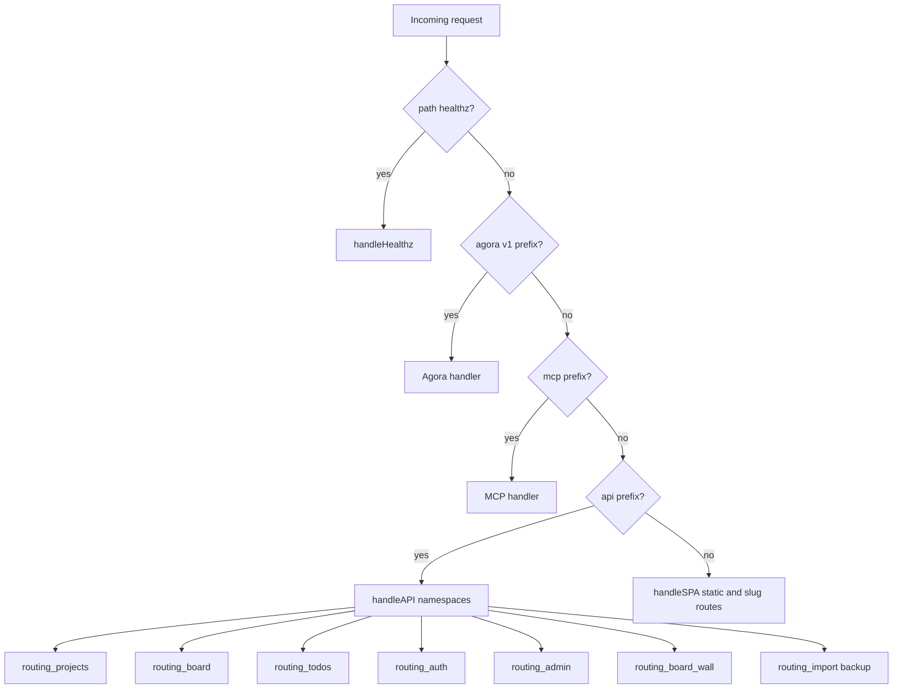

# HTTP request routing

Top-level dispatch in `internal/httpapi/server.go` `ServeHTTP`.

## SPA paths (`spa.go`)

- `/` landing or projects list
- `/dashboard` personal dashboard
- `/{slug}` canonical project board URL
- `/{slug}/t/{localId}` deep link to todo segment
- `/anon` anonymous temporary board creation (anonymous mode)

API lives under `/api/*` only; everything else falls through to embedded `web/dist` assets or slug canonicalization.
