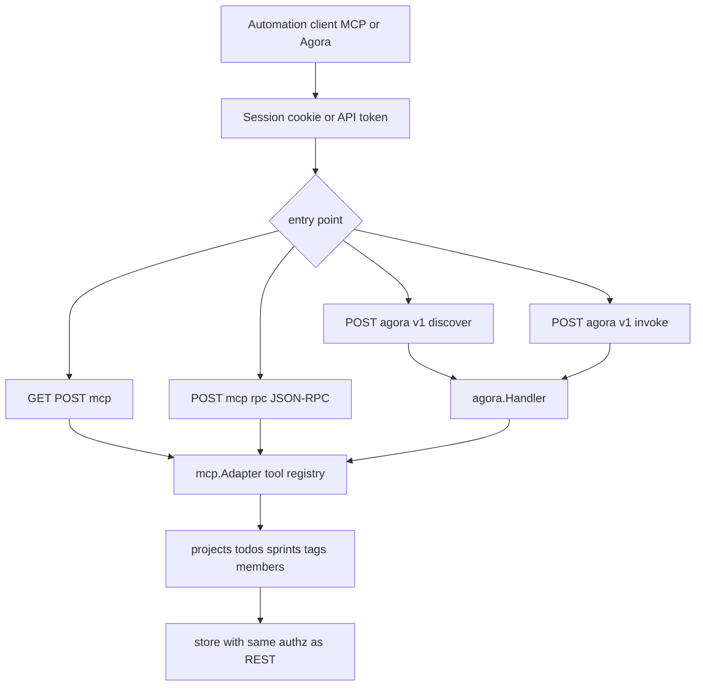

# MCP and Agora integration

Optional automation surface: API-token or session-authenticated clients can call the same store-backed tools as the REST API, via MCP HTTP or Agoragentic envelopes.

Tools are registered in `internal/mcp`; mode (`full` vs `anonymous`) gates which operations are exposed. Agora wraps MCP tool discovery and invocation for Agoragentic-compatible clients.
