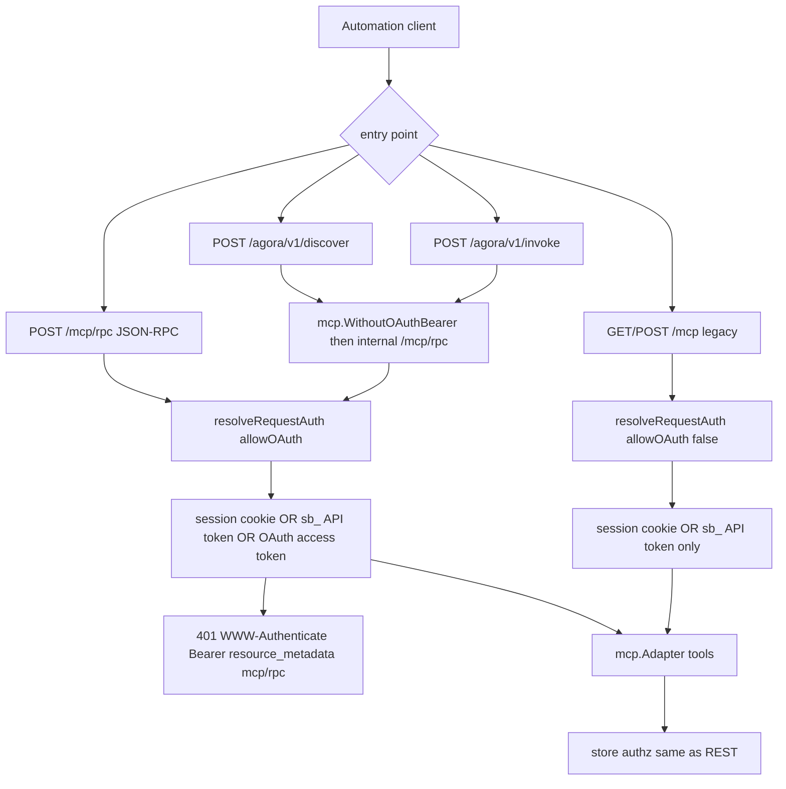

# MCP and Agora integration

Automation surfaces share store-backed tools but **not** the same bearer credential model. Only canonical `POST /mcp/rpc` accepts Scrumboy OAuth access tokens (resource-bound to `<origin>/mcp/rpc`). Legacy `/mcp` and Agora deliberately do not.

| Surface | Session cookie | `sb_…` API token | OAuth access token | Protected-resource challenge |
|---------|---------------:|-----------------:|-------------------:|-----------------------------:|
| Canonical `POST /mcp/rpc` | yes | yes | yes | yes |
| Legacy `/mcp` | yes | yes | no | no |
| `/agora/v1/*` | yes | yes | no (`WithoutOAuthBearer`) | no |

OAuth access tokens are **not** portable to legacy MCP or Agora. Tools are registered in `internal/mcp`; mode (`full` vs `anonymous`) gates which operations are exposed. Agora wraps MCP tool discovery and invocation for Agoragentic-compatible clients.
