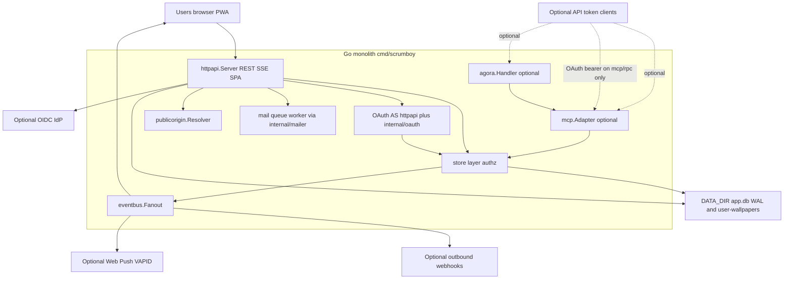

# Scrumboy system overview

Self-hosted Kanban and project management: one Go binary serves the embedded SPA, REST API, realtime SSE, and optional automation hooks, backed by SQLite under `DATA_DIR` plus file-backed uploads.

Core path: browser → HTTP → store → SQLite under `DATA_DIR`, plus file-backed uploads (such as `user-wallpapers/`) in the same directory, and SSE for live board updates. OAuth authorization-server routes (full mode) and SMTP mail delivery are optional long-lived surfaces. MCP, Agora, webhooks, and push share store authorization; only `/mcp/rpc` accepts OAuth access tokens (see `scrumboy_mcp_agora.md`).

## Package map

| Path | Role |
|------|------|
| `cmd/scrumboy` | Process entry, TLS, hourly maintenance (expired projects, OAuth artifacts, WAL checkpoint) |
| `internal/httpapi` | HTTP routing, OAuth AS routes, SSE hub, SPA embed, webhooks, push, mail queue/worker |
| `internal/store` | Domain logic and authorization |
| `internal/httpapi/web` | TypeScript SPA compiled to `dist/`; i18n catalogs, locale runtime, vendored flag assets |
| `internal/migrate` | Versioned SQL migrations (discovered from embedded files) |
| `internal/mcp` | Optional MCP HTTP and JSON-RPC tools |
| `internal/agora` | Optional Agoragentic adapter over MCP |
| `internal/oauth` | PKCE, opaque secrets, OAuth error wire format |
| `internal/publicorigin` | Trusted public origin / MCP resource URL resolution |
| `internal/mailer` | SMTP sender used by the `httpapi` mail worker |

For deployment, backup, and upgrade, see `scrumboy_deployment_ops.md`.
