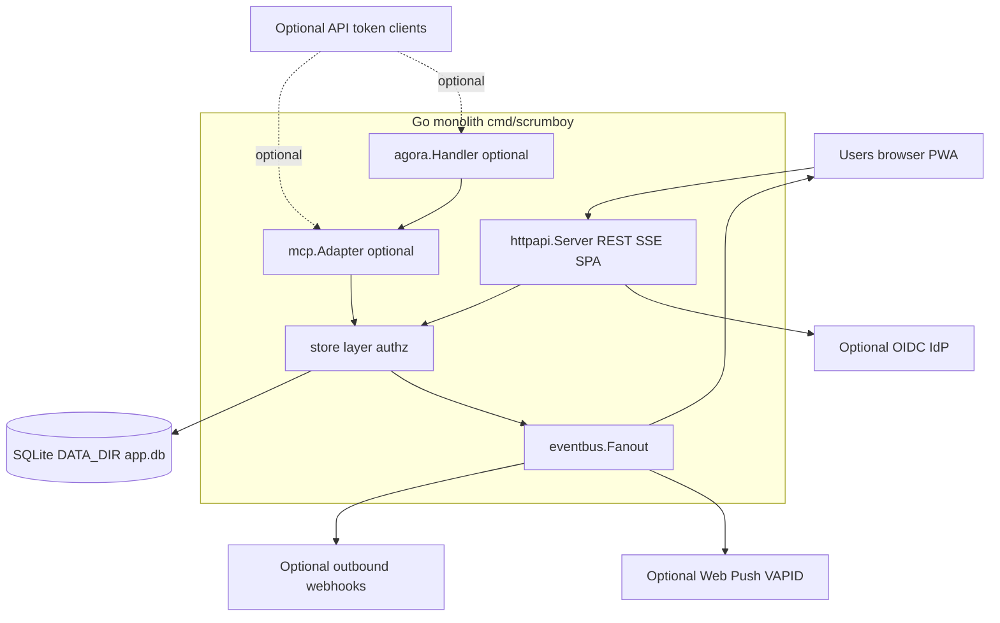

# Scrumboy system overview

Self-hosted Kanban and project management: one Go binary serves the embedded SPA, REST API, realtime SSE, and optional automation hooks, backed by SQLite.

Core path: browser to HTTP to store to SQLite, with SSE for live board updates. MCP, Agora, webhooks, and push are the same store and auth model, but optional for operators who want automation or notifications.

## Package map

| Path | Role |
|------|------|
| `cmd/scrumboy` | Process entry, TLS, hourly maintenance |
| `internal/httpapi` | HTTP routing, SSE hub, SPA embed, webhooks, push |
| `internal/store` | Domain logic and authorization |
| `internal/httpapi/web` | TypeScript SPA compiled to `dist/` |
| `internal/migrate` | Versioned SQL migrations |
| `internal/mcp` | Optional MCP HTTP and JSON-RPC tools |
| `internal/agora` | Optional Agoragentic adapter over MCP |

For deployment, backup, and upgrade, see `scrumboy_deployment_ops.md`.
