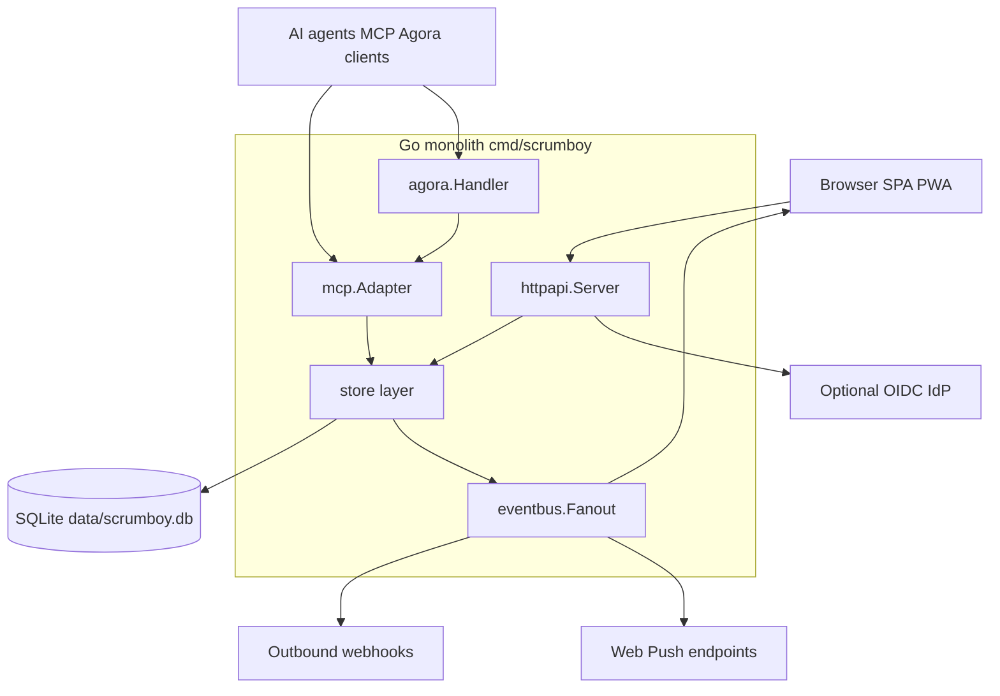

# Scrumboy system overview

Self-hosted Kanban / project management: one Go binary serves REST, MCP, Agora, SSE realtime, webhooks, and an embedded SPA backed by SQLite.

## Package map

| Path | Role |
|------|------|
| `cmd/scrumboy` | Process entry, TLS, hourly maintenance |
| `internal/httpapi` | HTTP routing, SSE hub, SPA embed, webhooks, push |
| `internal/store` | Domain logic and authorization |
| `internal/mcp` | MCP HTTP and JSON-RPC tool surface |
| `internal/agora` | Agoragentic discover and invoke over MCP |
| `internal/httpapi/web` | TypeScript SPA compiled to `dist/` |
| `internal/migrate` | Versioned SQL migrations |
