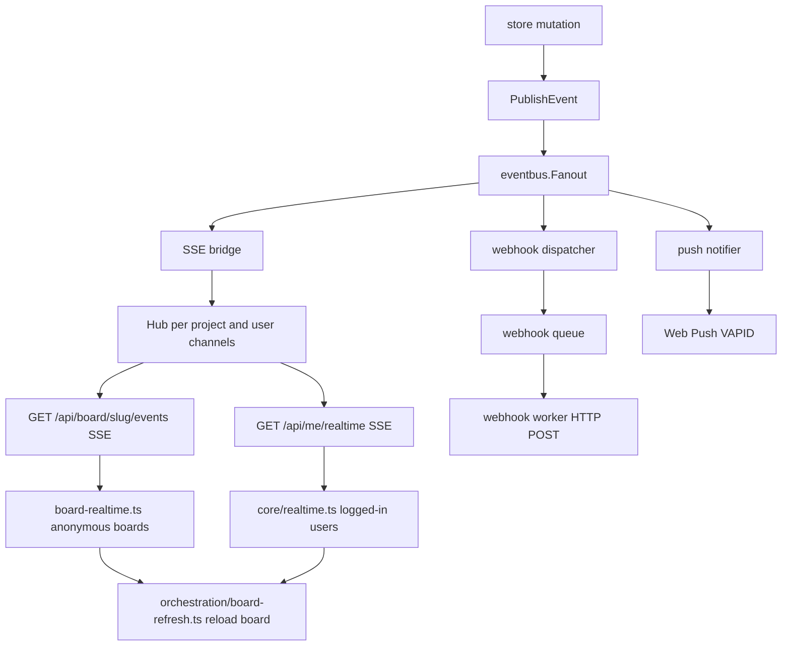

# Realtime events pipeline

Store mutations publish domain events; `eventbus.Fanout` fans out to SSE, webhooks, and push.

## SSE transport

| Client context | Endpoint | Module |
|----------------|----------|--------|
| Logged-in user | `GET /api/me/realtime` | `core/realtime.ts` (merged cross-project stream) |
| Anonymous board | `GET /api/board/{slug}/events` | `board-realtime.ts` (per-board stream) |

Both paths share `sse-client.ts` for the EventSource connection.

## Common event types

| Event | Typical consumer |
|-------|------------------|
| `board.refresh_needed` | SSE to browsers on that project |
| `board.members_updated` | SSE plus membership UI refresh |
| `todo.assigned` | Push notification to assignee; also on merged user stream |
| `wall.refresh_needed` | Wall canvas full refetch |
| `wall.transient` | Wall canvas incremental DOM update without refetch |
