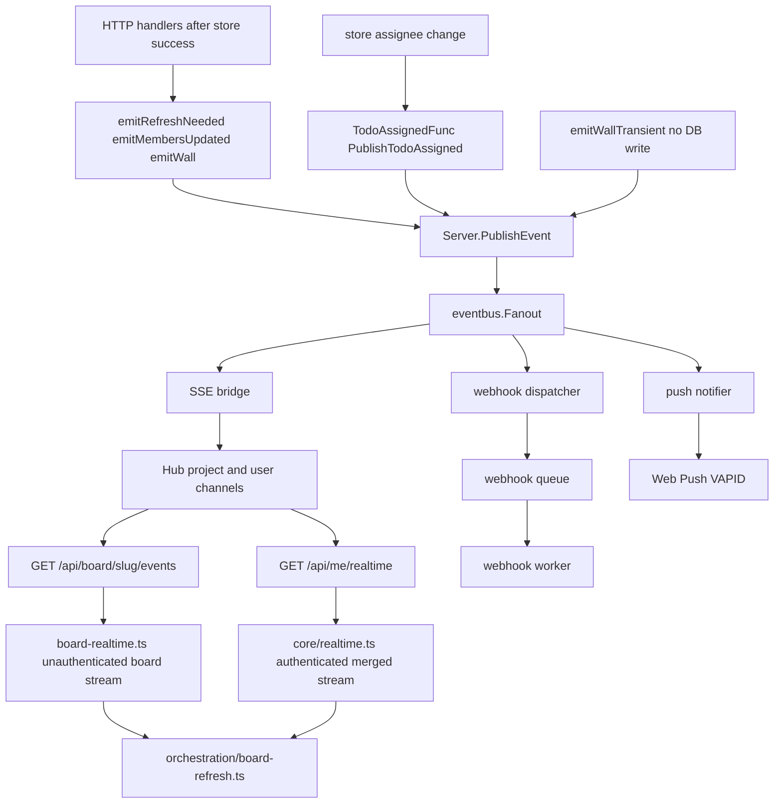

# Realtime events pipeline

Most domain events are published by HTTP handlers after successful store operations (`emitRefreshNeeded`, `emitMembersUpdated`, `emitWallRefreshNeeded`, `emitWallTransient` → `Server.PublishEvent`). Store mutations do not generally publish. Exception: todo assignee changes call `store.TodoAssignedFunc` set via `SetTodoAssignedPublisher(srv.PublishTodoAssigned)` in `main.go`.

## SSE transport

| Client context | Endpoint | Module |
|----------------|----------|--------|
| Authenticated user | `GET /api/me/realtime` | `core/realtime.ts` (merged user + accessible projects) |
| Unauthenticated board client | `GET /api/board/{slug}/events` | `board-realtime.ts` (per-board; also temp/share-style boards in full mode) |

Both paths share `sse-client.ts` for the EventSource connection.

## Common event types

| Event | Typical consumer |
|-------|------------------|
| `board.refresh_needed` | SSE to browsers on that project |
| `board.members_updated` | SSE plus membership UI refresh |
| `todo.assigned` | Push notification to assignee; also on merged user stream |
| `wall.refresh_needed` | Wall canvas full refetch |
| `wall.transient` | Ephemeral drag/move only (`emitWallTransient`); not a durable store mutation; SSE wire only |
