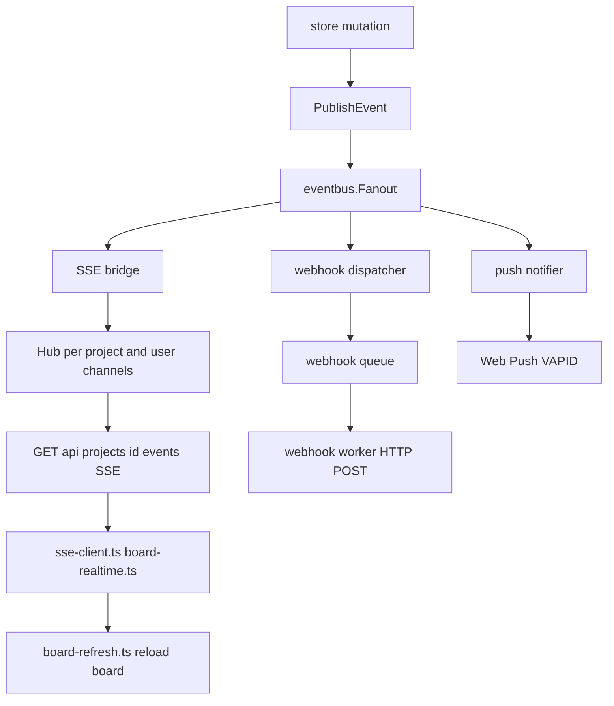

# Realtime events pipeline

Store mutations publish domain events; `eventbus.Fanout` fans out to SSE, webhooks, and push.

## Common event types

| Event | Typical consumer |
|-------|------------------|
| `board.refresh_needed` | SSE to browsers on that project |
| `board.members_updated` | SSE plus membership UI refresh |
| `todo.assigned` | Push notification to assignee |

Merged user stream: `GET /api/me/realtime` for cross-project notifications.
