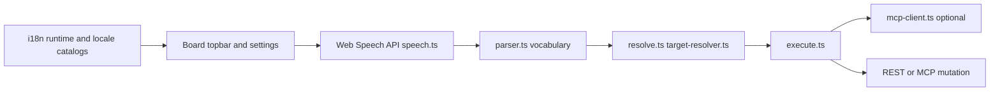
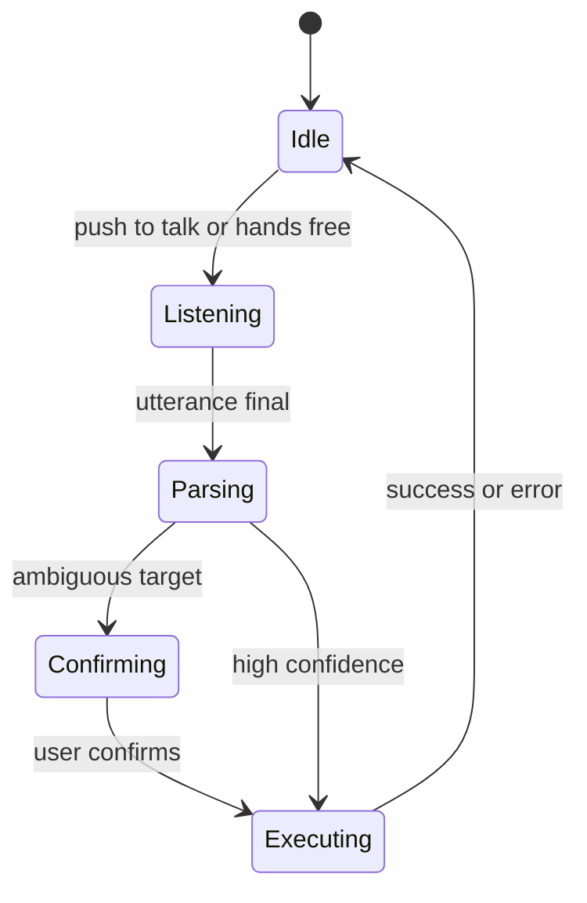

# VoiceFlow pipeline

Optional browser speech shortcuts for board actions (push-to-talk or hands-free). The surrounding board/settings UI localizes with the SPA i18n layer, but command grammar, spoken confirmations, and disambiguation words remain English-centric today.

## Locale boundary

- Board chrome and `Settings -> Customization -> VoiceFlow` copy follow the app locale.
- Parser vocabulary, built-in status aliases, spoken `yes` / `no` confirmations, and spoken disambiguation words currently stay English-centric.
- `Safe-Mode` is the safer choice in a non-English UI because the command grammar does not switch with the app locale yet.

## State machine

Preferences (`voiceflow-preferences.ts`) control enabled flag, hands-free confirmation, and mode. See `docs/voiceflow.md` for command vocabulary.
