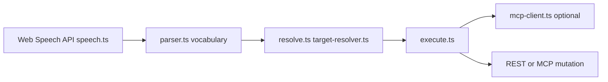
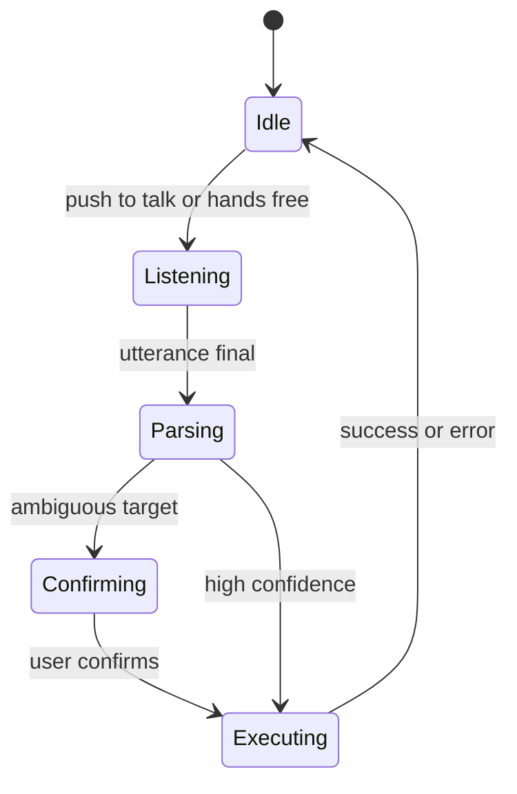

# VoiceFlow pipeline

Optional browser speech shortcuts for board actions (push-to-talk or hands-free). Parses utterances locally, then calls the same REST or MCP paths as manual UI actions.

## State machine

Preferences (`voiceflow-preferences.ts`) control enabled flag, hands-free confirmation, and mode. See `docs/voiceflow.md` for command vocabulary.
