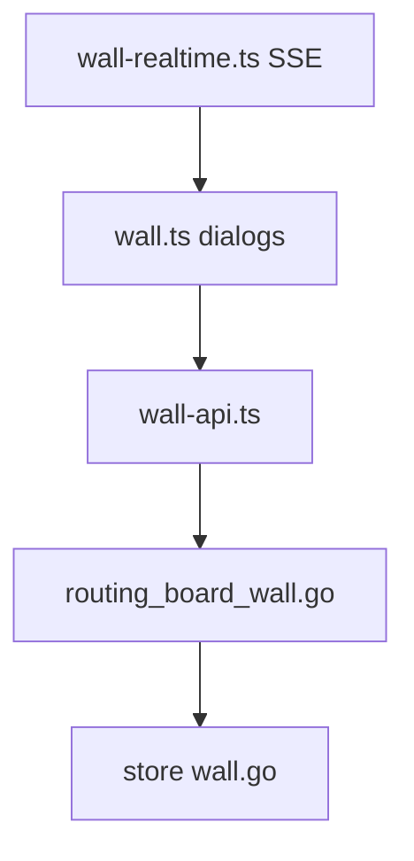
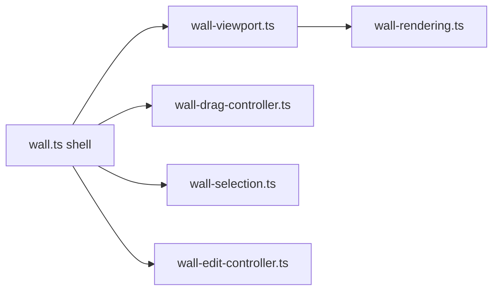

# Wall canvas (Scrumbaby)

Optional sticky-note canvas per project, gated by `SCRUMBOY_WALL_ENABLED`.

## Frontend submodules

Notes support viewport pan and zoom, multi-select, edges between notes, and Kalam handwriting font. When wall is disabled server returns 404 and the topbar button is hidden via bootstrap flags.
